# AIRLINES RESERVATION SYSTEM

## Mục lục
1. [Thành viên nhóm và phân công công việc](#i-thành-viên-nhóm-và-phân-công-công-việc)
2. [Cách thức đánh giá](#ii-cách-thức-đánh-giá)
   1. [Teamwork (15%)](#1-teamwork-15)
      1. [Giao tiếp](#11-giao-tiếp)
      2. [Theo dõi tiến độ](#12-theo-dõi-tiến-độ)
      3. [Quản lý mã nguồn bằng GIT](#13-quản-lý-mã-nguồn-bằng-git)
   2. [UI/UX (20%)](#2-uiux-20)
      1. [Mô tả chủ đề](#21-mô-tả-chủ-đề)
      2. [Cài đặt mã nguồn theo hướng đối tượng](#22-cài-đặt-mã-nguồn-theo-hướng-đối-tượng-3)
      3. [Các chức năng thêm và cải tiến](#23-các-chức-năng-thêm-và-cải-tiến-14)
      4. [Giao diện bố trí hợp lý](#24-giao-diện-bố-trí-hợp-lý-3)
   3. [Kiến trúc phần mềm và Design Pattern (20%)](#3-kiến-trúc-phần-mềm-và-design-pattern-20)
      1. [Mô tả kiến trúc phần mềm](#31-mô-tả-kiến-trúc-phần-mềm)
      2. [Áp dụng nguyên tắc SOLID](#32-áp-dụng-nguyên-tắc-solid)
      3. [Áp dụng Design Patterns](#33-áp-dụng-design-patterns)
   4. [Đảm bảo chất lượng (20%)](#4-đảm-bảo-chất-lượng-20)
      1. [Unit test](#41-unit-test)
         1. [Test Plan](#a-test-plan)
         2. [Test Case](#b-test-case)
         3. [Test Report](#c-test-report)
      2. [Coding Convention](#42-coding-convention)
      3. [Quản lý mã nguồn với GIT - Feature Branch Workflow](#43-quản-lý-mã-nguồn-với-git---feature-branch-workflow)
   5. [Tài liệu mô tả kiến trúc phần mềm và các module (10%)](#5-tài-liệu-mô-tả-kiến-trúc-phần-mềm-và-các-module-10)
   6. [Các chủ đề nâng cao (15%)](#6-các-chủ-đề-nâng-cao-15)
3. [Hướng dẫn chạy chương trình](#iii-hướng-dẫn-chạy-chương-trình)
4. [Link video demo](#iv-link-video-demo)

## I. Thành viên nhóm và phân công công việc:
### 1. Thông tin thành viên
| Họ tên | MSSV | Nhóm trưởng |
|-|:-:|:-:|
| Nguyễn Phúc Hoàng | 23120264 | `X` |
| Dương Nhật Cường | 23120223 | |

### 2. Phân công công việc
Phân công chi tiết được trình bày trong spreadsheet  [milestone](https://docs.google.com/spreadsheets/d/10Fg3uumLuMZ6uxxLJZAJpDxn2EyuMy1-oPprR4_YdoU/edit?usp=sharing)

#### Mô tả spreadsheet phân công:

| Tên sheet | Nội dung chính|
|:-:|-|
| **M1** | Phân tích yêu cầu & thiết kế hệ thống |
| **M2** | Thiết kế, kết nối cơ sở dữ liệu với chức năng và cài đặt chương trình toàn bộ dự án |
| **M3** | Kiểm thử và sửa lỗi |
| **M4** | Báo cáo và hoàn thiện hệ thống |
| **OOP** | Danh sách các mục áp dụng SOLID, Design Pattern, Dependency Injection trong đồ án |
| **ĐÁNH GIÁ** | Thống kê số task mỗi thành viên nhận và hoàn thành (tính tỷ lệ đóng góp) |

#### Tỉ lệ đóng góp của các thành viên vào dự án
| Tên thành viên | Số task hoàn thành | Tỉ lệ đóng góp |
|:-:|:-:|:-:|
| Nguyễn Phúc Hoàng |  |  |
| Dương Nhật Cường |  |  |

#### Tỉ lệ điểm của các thành viên: Chia đều

## II. Cách thức đánh giá:

### 1. Teamwork (15%):
#### 1.1. Giao tiếp:
- Trao đổi thông tin qua và họp qua Discord.
- Nhóm tổ chức họp định kỳ mỗi tuần một lần (trừ các tuần dính lịch thi học kỳ).
- Thư mục lưu trữ biên bản họp: [BIÊN BẢN HỌP](https://drive.google.com/drive/folders/1H37agCGiqLQLTfkh5w6cz3WedyLYk4zb?usp=drive_link)

#### 1.2. Theo dõi tiến độ:
- Thực hiện phân công theo mô hình phân chia [milestone](https://fastwork.vn/milestone-la-gi/).
- Lập kế hoạch: Chia nhỏ công việc theo các Milestone (1-2 tuần hoặc theo các phần), theo dõi tiến độ bằng Google Sheet.
- Kế hoạch dự án: [KẾ HOẠCH DỰ ÁN](https://docs.google.com/spreadsheets/d/17MIbYC_3728fK3oDs7YA8lyq8wD4hYn5dRZaQUcmwqk/edit?usp=sharing)
- Phân công công việc: [PHÂN CÔNG CÔNG VIỆC](https://docs.google.com/spreadsheets/d/10Fg3uumLuMZ6uxxLJZAJpDxn2EyuMy1-oPprR4_YdoU/edit?usp=sharing)
- Workspace: [ĐỒ ÁN OOP](https://drive.google.com/drive/folders/1MYWCPn5Pc7lfP3YCtnfkBv9NWD09XwXE?usp=drive_link) và Discord

#### 1.3. Quản lý mã nguồn bằng GIT:
##### a. Thống kê Git theo thành viên

| Thành viên | Tổng số commit | Tỷ lệ đóng góp |
|------------|:----------------:|:------------------:|
| Nguyễn Phúc Hoàng | 81 | 60% |
| Dương Nhật Cường | 55 | 40% |

##### b. Thống kê Git theo tuần

| Tuần | Số commit | Các tính năng chính | Thành viên thực hiện |
|------|-----------|---------------------|----------------------|
| Tuần 1 (29/04 - 05/05) | 15 | **Nguyễn Phúc Hoàng:**<br>- Khởi tạo project template<br>- Implement các model cơ bản (Flight, Passenger, Reservation)<br>- Thiết lập database connection<br>- Implement Logger<br><br>**Dương Nhật Cường:**<br>- Cập nhật thông tin SOLID<br>- Thêm class diagram để mô phỏng các lớp | Nguyễn Phúc Hoàng (12 commits)<br>Dương Nhật Cường (3 commits) |
| Tuần 2 (06/05 - 12/05) | 24 | **Nguyễn Phúc Hoàng:**<br>- Implement Repository Pattern<br>- Implement các service<br>- Implement Factory Pattern<br>- Test các repository<br>- Cập nhật database connection sử dụng Singleton Pattern<br><br>**Dương Nhật Cường:**<br>- Cài đặt Mock Repository<br> | Nguyễn Phúc Hoàng (12 commits)<br>Dương Nhật Cường (12 commits) |
| Tuần 3 (13/05 - 19/05) | 30 | **Nguyễn Phúc Hoàng:**<br>- Implement Value Objects (ContactInfo, SeatClass, AircraftSerial)<br>- Implement Core Entities<br>- Test các core entities<br>- Cập nhật schema database<br><br>**Dương Nhật Cường:**<br>- Cài đặt Mock Repository<br> - Implement các service hoàn chỉnh | Nguyễn Phúc Hoàng (20 commits)<br>Dương Nhật Cường (10 commits) |
| Tuần 4 (20/05 - 30/05) | 67 | **Nguyễn Phúc Hoàng:**<br>- Implement các service hoàn chỉnh<br>- Cập nhật documentation<br>- Hoàn thiện các tính năng<br>- Fix bugs trong service<br><br>**Dương Nhật Cường:**<br>- Test các service<br>- Cập nhật test cho aircraft service<br>- Hoàn thiện mock repository<br>- Phát triển UI<br>- Fix bugs trong UI | Nguyễn Phúc Hoàng (37 commits)<br>Dương Nhật Cường (30 commits) |

### 2. UI/UX (20%):
#### 2.1. Mô tả chủ đề
**Airline Reservation System** là một chương trình C++ kết nối với cơ sở dữ liệu MySQL, giúp quản lý một hệ thống đặt vé máy bay cho khách hàng. Hệ thống cho phép người dùng thực hiện các chức năng như tìm kiếm chuyến bay, đặt vé, hủy vé và quản lý thông tin hành khách. Chương trình sử dụng MySQL để lưu trữ thông tin về chuyến bay, hành khách và đơn hàng.

*Link tham khảo mã nguồn: https://www.codewithc.com/airlines-reservation-system-in-c-with-mysql/*

##### Các chức năng chính của hệ thống

- **Hệ thống cũ (Từ mã nguồn trên):**
  - **Reverse Seat**: Cho phép hành khách đặt chỗ trên chuyến bay, hủy chỗ và quản lý thông tin hành khách (Tên, Số điện thoại, Email, Passport, ...).
  - **User Ticket**: Cho phép tìm kiếm thông tin vé theo hành khách và hiển thị thông tin vé máy bay đã đặt của hành khách, bao gồm thông tin chuyến bay, ghế ngồi, thời gian bay, và trạng thái vé (đã xác nhận, đã hủy).
  - **Flight Schedule**: Hiển thị lịch trình chuyến bay (gồm số hiệu, điểm đến, giờ khởi hành, giờ dự kiến đến, ...).
  - **Display Passenger**: Hiển thị danh sách của các hành khách đã đặt vé trên chuyến bay cụ thể.
  - **Add New Flight**: Thêm một chuyến bay mới.
  - **Edit Flight**: Chỉnh sửa thông tin chuyến bay.
  - **Delete Flight**: Xóa chuyến bay khỏi hệ thống.
  - **Edlit Flight Leave and Arrive**: Sửa thông tin chuyến bay (thời gian khởi hành và thời gian đến).

- **Hệ thống mới (Bổ sung thêm vào dự án):**
  1.  **Quản lý Máy bay (Aircraft Management):**
      *   **Thêm máy bay mới:** Tạo thông tin máy bay mới với số hiệu (`AircraftSerial`), mẫu mã (`AircraftModel`), và sơ đồ ghế (`SeatClassMap`).
      *   **Xem thông tin máy bay:**
          *   Xem danh sách tất cả máy bay.
          *   Xem chi tiết một máy bay cụ thể (theo ID hoặc số hiệu).
          *   Kiểm tra số lượng ghế theo từng hạng ghế.
          *   Kiểm tra tính hợp lệ của một số ghế cụ thể trên máy bay.
      *   **Cập nhật thông tin máy bay:** Thay đổi mẫu mã, sơ đồ ghế của máy bay.
      *   **Xóa máy bay:** Loại bỏ máy bay khỏi hệ thống (có thể có các ràng buộc nếu máy bay đang được sử dụng cho chuyến bay).
      *   **Kiểm tra sự tồn tại của máy bay:** Dựa trên ID hoặc số hiệu.
      *   **Đếm số lượng máy bay.**

  2.  **Quản lý Chuyến bay (Flight Management):**
      *   **Tạo lịch trình chuyến bay mới:**
          *   Xác định số hiệu chuyến bay (`FlightNumber`).
          *   Xác định lộ trình (`Route` - điểm đi, điểm đến).
          *   Lên lịch trình (`Schedule` - thời gian khởi hành, thời gian đến).
          *   Gán một máy bay cụ thể (`Aircraft`) cho chuyến bay.
          *   Khởi tạo tình trạng ghế trống trên chuyến bay dựa trên sơ đồ ghế của máy bay được gán.
      *   **Xem thông tin chuyến bay:**
          *   Xem danh sách tất cả các chuyến bay.
          *   Xem chi tiết một chuyến bay cụ thể (theo ID hoặc số hiệu chuyến bay).
          *   Xem lộ trình, lịch trình, máy bay sử dụng, tình trạng chuyến bay (`FlightStatus`).
          *   Kiểm tra tình trạng ghế trống (theo số ghế cụ thể).
          *   Phân chia các hạng ghế: `ECONOMY`, `BUSINESS`, `FIRST_CLASS` (Có thể bổ sung thêm các hạng ghế khác nhờ Factory Pattern và Registry Pattern)
      *   **Cập nhật thông tin chuyến bay:**
          *   Thay đổi lịch trình (thời gian khởi hành/đến).
          *   Thay đổi máy bay (có thể phức tạp, cần cập nhật lại tình trạng ghế).
          *   Cập nhật trạng thái chuyến bay (ví dụ: SCHEDULED, BOARDING, DEPARTED, CANCELLED).
      *   **Hủy chuyến bay:** Đánh dấu chuyến bay là `CANCELLED`.
      *   **Quản lý ghế trên chuyến bay:**
          *   Đặt (reserve) một ghế cụ thể.
          *   Hủy đặt (release) một ghế cụ thể.
      *   **Kiểm tra sự tồn tại của chuyến bay:** Dựa trên ID hoặc số hiệu chuyến bay.
      *   **Đếm số lượng chuyến bay.**

  3.  **Quản lý Hành khách (Passenger Management):**
      *   **Đăng ký/Thêm hành khách mới:**
          *   Ghi nhận tên (`Name`).
          *   Lưu trữ thông tin liên lạc (`ContactInfo` - email, điện thoại, địa chỉ).
          *   Ghi nhận số hộ chiếu (`PassportNumber`).
      *   **Xem thông tin hành khách:**
          *   Xem danh sách tất cả hành khách.
          *   Xem chi tiết một hành khách cụ thể (theo ID hoặc số hộ chiếu).
      *   **Cập nhật thông tin hành khách:** Thay đổi tên, thông tin liên lạc.
      *   **Xóa hành khách:** Loại bỏ hành khách khỏi hệ thống (có thể có ràng buộc nếu hành khách đang có vé).
      *   **Kiểm tra sự tồn tại của hành khách:** Dựa trên ID hoặc số hộ chiếu.
      *   **Đếm số lượng hành khách.**

  4.  **Quản lý Vé (Ticket Management):**
      *   **Đặt vé/Tạo vé mới:**
          *   Liên kết vé với một hành khách (`Passenger`) và một chuyến bay (`Flight`).
          *   Gán một số ghế (`SeatNumber`) cụ thể trên chuyến bay đó cho vé.
          *   Xác định giá vé (`Price`).
          *   Gán số vé (`TicketNumber`) duy nhất.
          *   Đặt trạng thái ban đầu cho vé (ví dụ: `PENDING`).
      *   **Xem thông tin vé:**
          *   Xem danh sách tất cả các vé.
          *   Xem chi tiết một vé cụ thể (theo ID hoặc số vé).
          *   Xem thông tin hành khách, chuyến bay, số ghế, giá vé, trạng thái vé (`TicketStatus`).
      *   **Cập nhật trạng thái vé:**
          *   Xác nhận vé (`CONFIRMED`).
          *   Làm thủ tục (check-in) cho vé (`CHECKED_IN`).
          *   Lên máy bay (`BOARDED`).
          *   Hoàn thành chuyến đi (`COMPLETED`).
          *   Hủy vé (`CANCELLED`).
          *   Hoàn tiền (`REFUNDED`).
          *   Logic thay đổi trạng thái vé sẽ phụ thuộc vào trạng thái hiện tại của vé và trạng thái của chuyến bay liên quan (ví dụ: chỉ có thể check-in khi vé đã `CONFIRMED` và chuyến bay đang `BOARDING`).
      *   **Cập nhật thông tin vé:** Có thể cho phép thay đổi giá (ví dụ: nâng hạng).
      *   **Hủy vé:** Thay đổi trạng thái vé thành `CANCELLED` và giải phóng ghế trên chuyến bay.
      *   **Tìm kiếm vé:**
          *   Theo ID hành khách.
          *   Theo số hiệu máy bay (liên quan đến các chuyến bay sử dụng máy bay đó).
      *   **Kiểm tra sự tồn tại của vé:** Dựa trên ID hoặc số vé.
      *   **Đếm số lượng vé.**

  5.  **Chức năng Phụ trợ và Xác thực:**
      *   **Xác thực dữ liệu đầu vào:** Đảm bảo số hiệu máy bay, số hiệu chuyến bay, thông tin liên lạc, số hộ chiếu, sơ đồ ghế, v.v., đều hợp lệ trước khi tạo hoặc cập nhật đối tượng.
      *   **Quản lý lỗi:** Hệ thống sử dụng `Result<T>` để quản lý và trả về các lỗi một cách có cấu trúc (gồm mã lỗi và nội dung lỗi).
      *   **Ghi log (Logging):** Hệ thống có cơ chế ghi log các hoạt động và lỗi (thông qua `Logger`).
      *   **Kết nối và tương tác với cơ sở dữ liệu:** Được quản lý bởi `IDatabaseConnection` và các `Repository`.

#### 2.2. Cài đặt mã nguồn theo hướng đối tượng (3%)

Dự án được thiết kế và triển khai theo hướng đối tượng với các nguyên tắc cơ bản sau:

1. **Tính đóng gói (Encapsulation):**
   - Các thuộc tính của lớp được khai báo private để bảo vệ dữ liệu
   - Cung cấp các phương thức public để truy cập và thao tác với dữ liệu
   - Validation được tích hợp trong quá trình tạo và cập nhật đối tượng

   Ví dụ từ `SeatClassMap`:
   ```cpp
   class SeatClassMap {
   private:
       std::map<SeatClass, int> _seatCounts;  // Private data

   public:
       // Public methods for data access
       bool hasSeatClass(const std::string& seatClassCode) const;
       int getSeatCount(const std::string& seatClassCode) const;
       bool isValidSeatNumber(const std::string& seatNumber) const;
   };
   ```

2. **Tính kế thừa (Inheritance):**
   - Sử dụng interface `IEntity` làm lớp cơ sở cho các thực thể
   - Các lớp như `Aircraft`, `Flight`, `Ticket` kế thừa từ `IEntity`
   - Tái sử dụng code thông qua kế thừa và mở rộng chức năng

   Ví dụ từ `IEntity`:
   ```cpp
   class IEntity {
   public:
       virtual int getId() const = 0;
       virtual std::string getStringId() const = 0;
       virtual std::string toString() const = 0;
       virtual bool equals(const IEntity& other) const = 0;
   };

   class Aircraft : public IEntity {
   public:
       int getId() const override;
       std::string getStringId() const override;
       std::string toString() const override;
       bool equals(const IEntity& other) const override;
   };
   ```

3. **Tính đa hình (Polymorphism):**
   - Sử dụng virtual methods và pure virtual functions
   - Cho phép các lớp con triển khai các phương thức theo cách riêng
   - Hỗ trợ xử lý đối tượng thông qua interface chung

   Ví dụ từ `IRepository`:
   ```cpp
   template<typename T, typename IdType = int>
   class IRepository {
   public:
       virtual Result<T> findById(const IdType& id) = 0;
       virtual Result<std::vector<T>> findAll() = 0;
       virtual Result<T> create(const T& entity) = 0;
       virtual Result<T> update(const T& entity) = 0;
       virtual Result<bool> deleteById(const IdType& id) = 0;
   };

   class AircraftRepository : public IRepository<Aircraft> {
   public:
       Result<Aircraft> findById(const int& id) override;
       Result<std::vector<Aircraft>> findAll() override;
       Result<Aircraft> create(const Aircraft& entity) override;
       Result<Aircraft> update(const Aircraft& entity) override;
       Result<bool> deleteById(const int& id) override;
   };
   ```

4. **Tính trừu tượng (Abstraction):**
   - Tách biệt interface và implementation
   - Định nghĩa các phương thức cần thiết trong interface
   - Ẩn đi chi tiết triển khai phức tạp

   Ví dụ từ `IDatabaseConnection`:
   ```cpp
   class IDatabaseConnection {
   public:
       virtual Result<bool> connect() = 0;
       virtual void disconnect() = 0;
       virtual Result<QueryResult> executeQuery(const std::string& query) = 0;
       virtual Result<bool> beginTransaction() = 0;
       virtual Result<bool> commit() = 0;
       virtual Result<bool> rollback() = 0;
   };

   class MySQLXConnection : public IDatabaseConnection {
   public:
       Result<bool> connect() override;
       void disconnect() override;
       Result<QueryResult> executeQuery(const std::string& query) override;
       Result<bool> beginTransaction() override;
       Result<bool> commit() override;
       Result<bool> rollback() override;
   };
   ```

5. **Quản lý tài nguyên:**
   - Sử dụng smart pointers để quản lý bộ nhớ
   - Đảm bảo giải phóng tài nguyên đúng cách
   - Tuân thủ nguyên tắc RAII

   Ví dụ từ `TicketService`:
   ```cpp
   class TicketService {
   private:
       std::shared_ptr<TicketRepository> _ticketRepo;
       std::shared_ptr<PassengerRepository> _passengerRepo;
       std::shared_ptr<FlightRepository> _flightRepo;
       std::shared_ptr<Logger> _logger;
   };
   ```

6. **Xử lý lỗi:**
   - Sử dụng cơ chế xử lý lỗi có cấu trúc
   - Validation được thực hiện ở mọi bước
   - Thông báo lỗi rõ ràng và dễ hiểu

   Ví dụ từ `Result`:
   ```cpp
   template<typename T>
   class Result {
   private:
       std::variant<T, Error> _value;
   public:
       bool hasError() const;
       T getValue() const;
       Error getError() const;
   };
   ```

7. **Tổ chức code:**
   - Phân chia code thành các module rõ ràng
   - Mỗi lớp có một trách nhiệm cụ thể
   - Documentation đầy đủ cho các lớp và phương thức

   Cấu trúc thư mục:
   ```
   src/
   ├── core/           # Domain Layer
   │   ├── entities/   # Core Entities
   │   ├── value_objects/  # Value Objects
   │   └── validators/ # Validators
   ├── database/       # Data Access Layer
   ├── repositories/   # Repository Layer
   ├── services/       # Service Layer
   ├── utils/          # Infrastructure Layer
   └── tests/          # Test Suite
   ```

#### 2.3. Các chức năng thêm và cải tiến (14%)

1.  **Quản lý Máy bay Chi tiết hơn:**
      *   Phiên bản có `Aircraft` với `SeatClassMap`, cho phép quản lý chi tiết số lượng ghế theo từng hạng (Economy, Business, First). Phiên bản tham khảo không đề cập đến việc quản lý chi tiết này.
      *   Khả năng kiểm tra tính hợp lệ của số ghế (`isValidSeatNumber`).

2.  **Quản lý Chuyến bay Phức tạp hơn:**
    *   **Phiên bản mới:**
        *   `Flight` liên kết với một `Aircraft` cụ thể (thông qua `std::shared_ptr<Aircraft>`), cho phép truy cập thông tin máy bay và sơ đồ ghế.
        *   Quản lý tình trạng ghế trống trên chuyến bay (`_seatAvailability` trong `Flight`).
        *   Quản lý trạng thái chuyến bay (`FlightStatus` - SCHEDULED, BOARDING, CANCELLED, etc.).
        *   Sử dụng `Route` và `Schedule` làm Value Object, đảm bảo tính nhất quán.
    *   **Phiên bản tham khảo:** "Flight Details" có vẻ đơn giản hơn, "Flight Leave And Arrive" có thể là cập nhật trạng thái hoặc thời gian thực tế. Thông tin ghế không được quản lý chi tiết trên từng chuyến bay.

3.  **Quản lý Hành khách và Thông tin Liên hệ Bài bản:**
    *   **Phiên bản mới:**
        *   `Passenger` entity.
        *   `ContactInfo` là một Value Object với email, phone, address và có trình xác thực riêng (`ContactInfoValidator`).
        *   `PassportNumber` là một Value Object với trình xác thực riêng.
    *   **Phiên bản tham khảo:** Thông tin hành khách được nhập trực tiếp và lưu vào bảng `userreservation_tb` mà không có đối tượng `Passenger` hay `ContactInfo` riêng biệt với logic xác thực mạnh mẽ.

4.  **Quản lý Vé Chuyên sâu:**
    *   **Phiên bản mới:**
        *   `Ticket` là một Entity trung tâm, liên kết `Passenger` và `Flight`.
        *   Quản lý `SeatNumber` cụ thể cho vé.
        *   Quản lý `Price` (với amount và currency) như một Value Object.
        *   Quản lý trạng thái vé (`TicketStatus` - PENDING, CONFIRMED, CANCELLED, etc.) với các logic nghiệp vụ như `canBeCancelled()`, `canBeCheckedIn()`.
    *   **Phiên bản tham khảo:** Chức năng "Reserve Seat" và "User Ticket" có vẻ đơn giản là ghi/đọc thông tin đặt chỗ. Khái niệm "Ticket" không phải là một đối tượng phức tạp với các trạng thái và logic riêng.

5.  **An toàn hơn:**
    *   **Phiên bản mới:** Việc sử dụng prepared statements (mặc dù `MySQLXConnection` hiện tại mô phỏng nó bằng cách xây dựng chuỗi query) và các Value Object giúp giảm nguy cơ SQL Injection so với việc ghép chuỗi trực tiếp như phiên bản tham khảo.
    *   **Phiên bản tham khảo:** Dễ bị SQL Injection do ghép chuỗi query trực tiếp.

6.  **Quản lý Lỗi Tốt hơn:**
    *   **Phiên bản mới:**
        * Sử dụng `Result<T>` (dựa trên `std::expected`) để xử lý lỗi một cách tường minh và có cấu trúc, tránh việc chương trình bị dừng đột ngột và cho phép client xử lý lỗi một cách linh hoạt.
        * Ghi log (Logging): Hệ thống có cơ chế ghi log các hoạt động và lỗi (thông qua `Logger`) để phục vụ việc DEBUG chương trình phức tạp và giúp dễ dàng hơn trong việc xử lý các lỗi chương trình.
    *   **Phiên bản tham khảo:** Kiểm tra lỗi thủ công sau mỗi lệnh `mysql_query` và chỉ hiển thị mã lỗi.

7.  **Tính Toàn vẹn và Xác thực Dữ liệu Mạnh mẽ:**
    *   **Phiên bản mới:**
        *   **Value Objects:** Đảm bảo các giá trị như số hiệu máy bay, số hiệu chuyến bay, thông tin liên hệ, v.v., luôn hợp lệ ngay từ khi tạo.
        *   **Validators:** Các lớp Validator riêng biệt (ví dụ `AircraftSerialValidator`) chứa logic xác thực phức tạp.
        *   Factory methods (`create()`) trong Entity và Value Object thường đi kèm xác thực.
    *   **Phiên bản tham khảo:** Không có cơ chế xác thực dữ liệu đầu vào rõ ràng trước khi đưa vào CSDL.

8. **Cải tiến về Kiến trúc:**
   - **Phân tầng rõ ràng:** Core, Repository, Service, Utils
   - **Tách biệt logic nghiệp vụ:** Mỗi entity có trách nhiệm riêng
   - **Value Objects:** Đảm bảo tính toàn vẹn dữ liệu
   - **Repository Pattern:** Tách biệt logic truy cập dữ liệu

9. **Cải tiến về Giao diện:**
   - **Menu tương tác:** Giao diện menu rõ ràng, dễ sử dụng
   - **Hiển thị thông tin:** Định dạng thông tin dễ đọc
   - **Xử lý lỗi:** Thông báo lỗi rõ ràng, hướng dẫn người dùng

#### 2.4. Giao diện bố trí hợp lý (3%)
Hệ thống đặt vé máy bay được xây dựng với giao diện sử dụng thư viện đồ hoạ wxWidgets, bố trí hợp lý, rõ ràng, giúp người dùng dễ thao tác và quản lý thông tin. Cụ thể:

1. **Menu chính phân nhóm chức năng rõ ràng**
   - Giao diện chính (`MainUI`) hiển thị các nhóm chức năng lớn:  
     + Quản lý máy bay  
     + Quản lý chuyến bay  
     + Quản lý hành khách  
     + Quản lý vé  
     + Thoát chương trình  
   - Người dùng lựa chọn chức năng bằng phím số, sau đó được chuyển đến menu con tương ứng.
    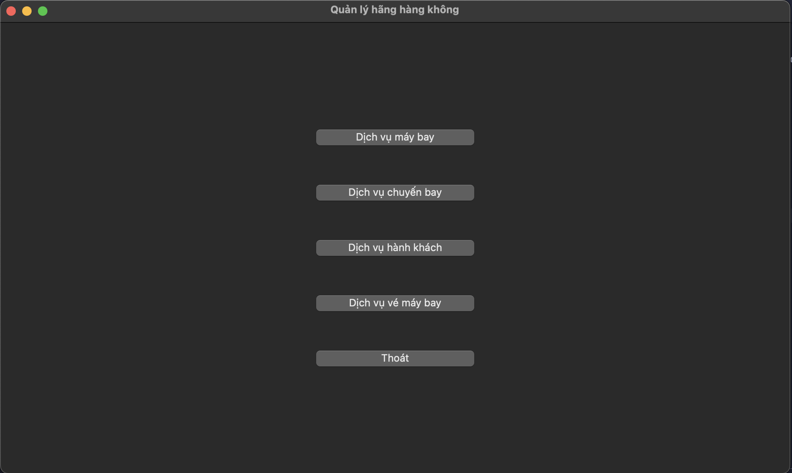

2. **Menu con chuyên biệt cho từng nghiệp vụ**
   - Mỗi nhóm chức năng có menu con riêng (ví dụ: `AircraftUI`, `FlightUI`, `PassengerUI`, `TicketUI`), gồm các thao tác như:  
     + Thêm, sửa, xóa, xem danh sách, tìm kiếm, xem chi tiết.
   - Các thao tác được đánh số thứ tự, hướng dẫn rõ ràng.
    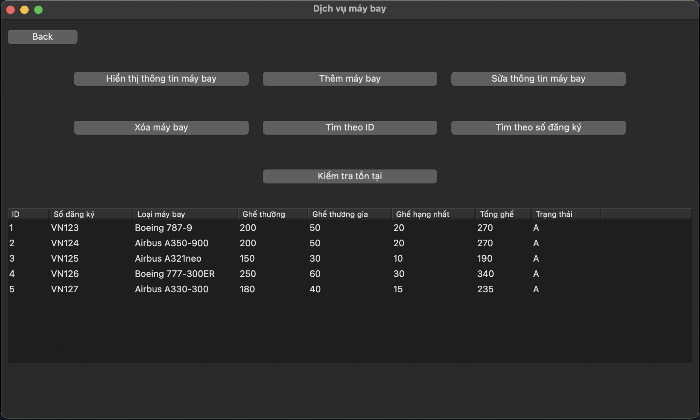
    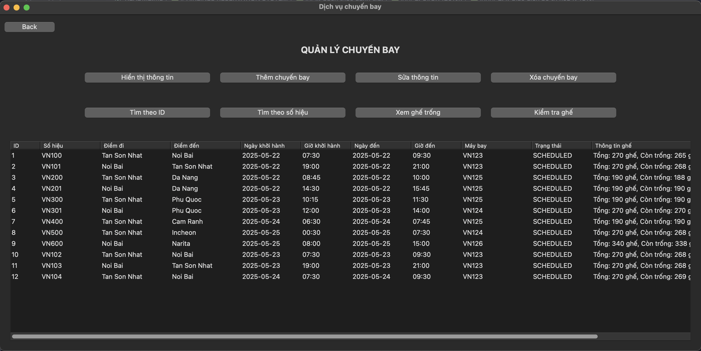
    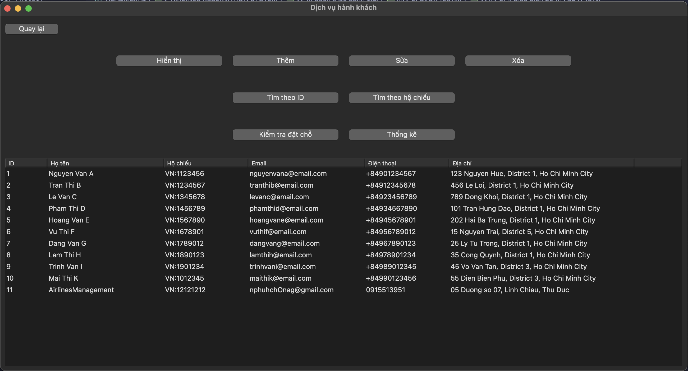
    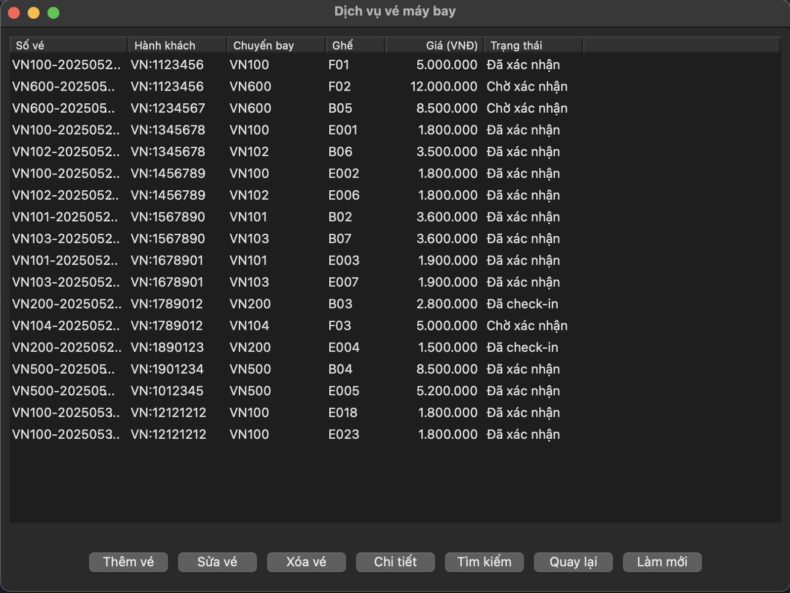

3. **Hiển thị thông tin dạng bảng, căn lề hợp lý**
   - Danh sách máy bay, chuyến bay, hành khách, vé... được trình bày theo bảng, có tiêu đề cột, căn lề thẳng hàng, giúp dễ quan sát.
   - Thông tin chi tiết từng đối tượng được hiển thị đầy đủ, rõ ràng, có phân tách từng trường dữ liệu.

4. **Luồng thao tác hợp lý, có xác nhận và thông báo**
   - Khi thực hiện các thao tác quan trọng (thêm, sửa, xóa), hệ thống đều yêu cầu xác nhận từ người dùng.
    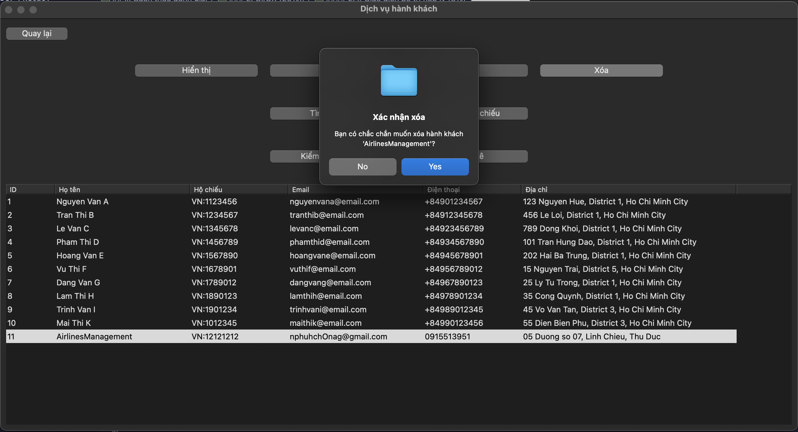
   - Sau mỗi thao tác, chương trình hiển thị thông báo thành công hoặc lỗi, hướng dẫn người dùng tiếp tục hoặc quay lại menu.
    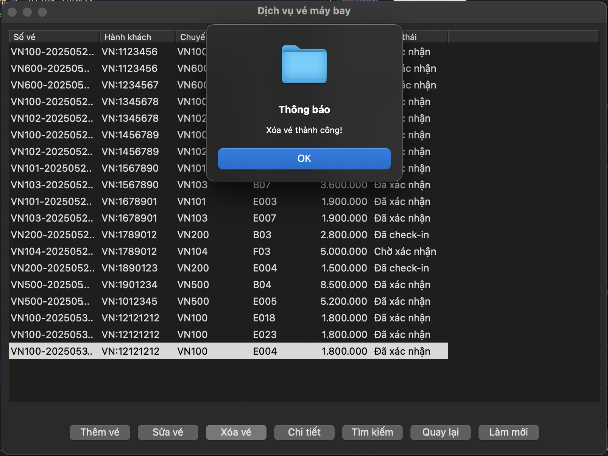
    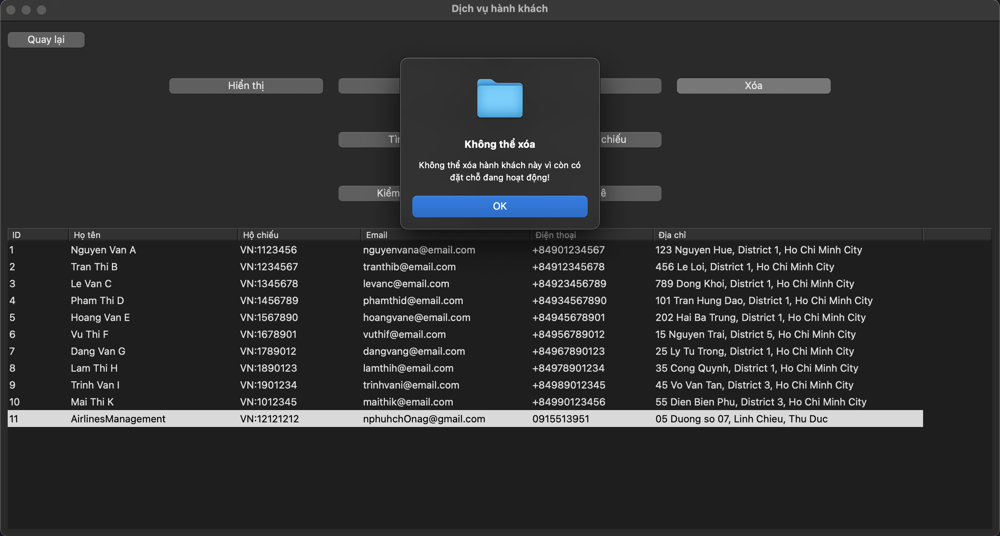
5. **Xử lý lỗi và nhập liệu thân thiện**
   - Nếu nhập sai định dạng hoặc dữ liệu không hợp lệ, hệ thống sẽ thông báo lỗi cụ thể và yêu cầu nhập lại.
   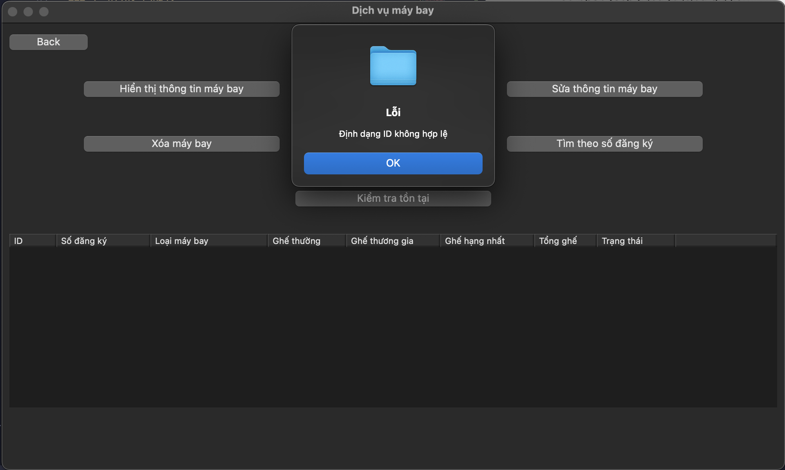
   - Các trường nhập liệu đều có hướng dẫn rõ ràng về định dạng, ví dụ: số hiệu chuyến bay, số ghế, email, số điện thoại...
    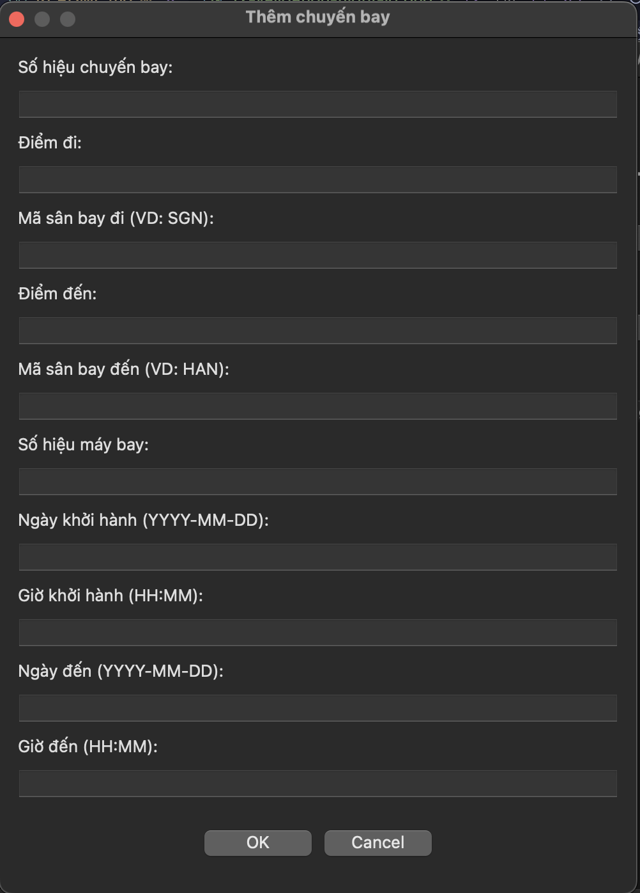
6. **Tính nhất quán và dễ sử dụng**
   - Giao diện các menu và bảng thông tin được thiết kế nhất quán về bố cục, giúp người dùng dễ làm quen và thao tác.
   - Các phím tắt/quay lại menu luôn được hướng dẫn ở cuối mỗi màn hình.

### 3. Kiến trúc phần mềm và Design Pattern (20%)
#### 3.1. Mô tả kiến trúc phần mềm:

Dự án được thiết kế theo kiến trúc phân tầng (Layered Architecture) kết hợp với Domain-Driven Design (DDD), bao gồm các tầng sau:

##### 1. Domain Layer (Tầng Miền/Nghiệp vụ)
- **Core Entities:**
  * `Aircraft`: Quản lý thông tin máy bay, sơ đồ ghế
  * `Flight`: Quản lý chuyến bay, lịch trình, trạng thái
  * `Passenger`: Quản lý thông tin hành khách
  * `Ticket`: Quản lý vé, trạng thái vé, giá vé

- **Value Objects:**
  * `AircraftSerial`, `FlightNumber`: Định danh duy nhất
  * `SeatClassMap`, `SeatNumber`: Quản lý thông tin ghế
  * `Route`, `Schedule`: Thông tin lộ trình và lịch trình
  * `ContactInfo`, `PassportNumber`: Thông tin liên hệ và định danh
  * `Price`, `TicketNumber`: Thông tin giá và số vé

- **Validators:**
  * Các lớp validator riêng biệt cho từng loại dữ liệu
  * Đảm bảo tính hợp lệ của dữ liệu đầu vào

##### 2. Data Access Layer (Tầng Truy cập Dữ liệu)
- **Database Abstraction:**
  * `IDatabaseConnection`: Interface định nghĩa các thao tác cơ sở dữ liệu
  * `MySQLXConnection`: Triển khai cụ thể cho MySQL

- **Repositories:**
  * `IRepository<T, IdType>`: Interface chung cho các repository
  * `AircraftRepository`: Quản lý dữ liệu máy bay
  * `FlightRepository`: Quản lý dữ liệu chuyến bay
  * `PassengerRepository`: Quản lý dữ liệu hành khách
  * `TicketRepository`: Quản lý dữ liệu vé

##### 3. Service Layer (Tầng Dịch vụ)
- **Business Services:**
  * `AircraftService`: Xử lý logic nghiệp vụ liên quan đến máy bay
  * `FlightService`: Xử lý logic nghiệp vụ liên quan đến chuyến bay
  * `PassengerService`: Xử lý logic nghiệp vụ liên quan đến hành khách
  * `TicketService`: Xử lý logic nghiệp vụ liên quan đến vé

##### 4. Presentation Layer (Tầng Giao diện)
- **User Interface:**
  * Menu tương tác với người dùng
  * Hiển thị thông tin và nhận lệnh từ người dùng
  * Xử lý và hiển thị lỗi

##### 5. Infrastructure Layer (Tầng Cơ sở hạ tầng)
- **Utilities:**
  * `Logger`: Ghi log hệ thống
  * `Result<T>`: Xử lý lỗi có cấu trúc
  * Các tiện ích khác

- **Testing:**
  * Unit tests cho các thành phần
  * Integration tests cho các repository

##### Cấu trúc thư mục phản ánh kiến trúc:
```
src/
├── core/           # Domain Layer
│   ├── entities/   # Core Entities
│   ├── value_objects/  # Value Objects
│   └── validators/ # Validators
├── database/       # Data Access Layer
│   └── mysql/      # MySQL Implementation
├── repositories/   # Repository Layer
├── services/       # Service Layer
├── utils/          # Infrastructure Layer
├── tests/          # Test Suite
└── ui/             # Presentation Layer
```

##### Luồng xử lý:
1. Người dùng tương tác qua UI
2. UI gọi các service tương ứng
3. Service thực hiện logic nghiệp vụ và gọi repository
4. Repository tương tác với database thông qua database connection
5. Kết quả được trả về theo chiều ngược lại
6. Lỗi được xử lý và hiển thị phù hợp

##### Ưu điểm của kiến trúc:
1. **Tách biệt quan tâm:** Mỗi tầng có trách nhiệm riêng biệt
2. **Dễ bảo trì:** Thay đổi một tầng không ảnh hưởng đến tầng khác
3. **Dễ mở rộng:** Có thể thêm tính năng mới mà không ảnh hưởng code hiện có
4. **Dễ test:** Các thành phần có thể test độc lập
5. **Tái sử dụng:** Code được tổ chức để tối đa khả năng tái sử dụng

#### 3.2. Áp dụng nguyên tắc SOLID:

Dự án đã áp dụng các nguyên tắc SOLID trong thiết kế và triển khai:

##### 1. Single Responsibility Principle (SRP)
- **Mỗi lớp chỉ có một lý do để thay đổi:**
  * `AircraftRepository`: Chỉ chịu trách nhiệm quản lý dữ liệu máy bay
  * `TicketService`: Chỉ xử lý logic nghiệp vụ liên quan đến vé
  * `SeatClassMapParser`: Chỉ thực hiện việc phân tích chuỗi thành bản đồ hạng ghế
  * `Logger`: Chỉ ghi log hệ thống
  * ...

##### 2. Open/Closed Principle (OCP)
- **Mở rộng mà không cần sửa đổi code hiện có:**
  * `ISeatClassMapParserStrategy`: Cho phép thêm các hạng ghế mới mà không phải sửa đổi toàn bộ hệ thống code hiện có
  * `ITicketSearchStrategy`: Cho phép thêm các chiến lược tìm kiếm vé mới
  * `IDatabaseConnection`: Cho phép thêm các implementation database mới như SQL Server, PostgreSQL,...
  * ...

##### 3. Liskov Substitution Principle (LSP)
- **Các lớp con có thể thay thế lớp cha:**
  * `Aircraft`, `Flight`, `Ticket` kế thừa từ `IEntity` và có thể sử dụng thay thế
  * `MySQLXConnection` thay thế được cho `IDatabaseConnection`
  * `StandardSeatClassMapParser` thay thế được cho `ISeatClassMapParserStrategy`
  * ...

##### 4. Interface Segregation Principle (ISP)
- **Interface nhỏ và tập trung:**
  * `IEntity`: Chỉ định nghĩa các phương thức cơ bản cho entity
  * `IRepository`: Chỉ định nghĩa các thao tác CRUD cơ bản
  * `ITicketSearchStrategy`: Chỉ định nghĩa phương thức tìm kiếm vé
  * ...

##### 5. Dependency Inversion Principle (DIP)
- **Phụ thuộc vào abstraction:**
  * Services phụ thuộc vào `IRepository` thay vì implementation cụ thể
  * Repositories phụ thuộc vào `IDatabaseConnection` thay vì MySQL trực tiếp
  * Parser phụ thuộc vào `ISeatClassMapParserStrategy` thay vì parser cụ thể
  * ...

#### 3.3. Áp dụng Design Patterns:

##### 1. Repository Pattern
- **Repository Pattern** là một mẫu thiết kế (design pattern) thuộc nhóm architectural patterns hoặc Domain-driven Design (DDD patterns), không phải Gang of Four (GoF pattern)
- **Lý do áp dụng:**
  * Cần tách biệt logic truy cập dữ liệu khỏi business logic để dễ dàng thay đổi nguồn dữ liệu
  * Muốn đơn giản hóa việc truy cập dữ liệu cho các service
  * Cần một interface thống nhất cho việc thao tác với dữ liệu
  * Muốn dễ dàng thay đổi implementation của data access layer

- **Triển khai:**
  ```cpp
  // Interface định nghĩa các thao tác CRUD cơ bản
  template<typename T, typename IdType = int>
  class IRepository {
  public:
      virtual Result<T> findById(const IdType& id) = 0;
      virtual Result<std::vector<T>> findAll() = 0;
      virtual Result<bool> exists(const IdType& id) = 0;
      virtual Result<size_t> count() = 0;
      virtual Result<T> create(const T& entity) = 0;
      virtual Result<T> update(const T& entity) = 0;
      virtual Result<bool> deleteById(const IdType& id) = 0;
  };
  ```

- **Lợi ích:**
  * **Tách biệt quan tâm:** Business logic không cần biết chi tiết về cách dữ liệu được lưu trữ
  * **Dễ dàng thay đổi:** Có thể chuyển từ MySQL sang PostgreSQL (hoặc một hệ quản trị cơ sở dữ liệu khác) mà không ảnh hưởng đến business logic
  * **Dễ test:** Có thể tạo mock repository để test business logic mà không cần database
  * **Tái sử dụng code:** Interface chung cho tất cả các repository
  * **Bảo mật:** Tập trung logic truy cập dữ liệu, dễ dàng kiểm soát và bảo mật

##### 2. Strategy Pattern
- **Lý do áp dụng:**
  * Cần nhiều cách khác nhau để tìm kiếm vé (theo giá, theo hành khách, theo chuyến bay)
  * Muốn dễ dàng thêm các chiến lược tìm kiếm mới
  * Cần thay đổi chiến lược tìm kiếm trong runtime
  * Muốn tách biệt logic tìm kiếm khỏi business logic

- **Triển khai:**
  ```cpp
  class ITicketSearchStrategy {
  public:
      virtual Result<std::vector<Ticket>> execute() = 0;
      virtual std::string getStrategyName() const = 0;
  };

  class PriceRangeSearchStrategy : public ITicketSearchStrategy {
  private:
      std::shared_ptr<TicketRepository> _repository;
      double _minPrice;
      double _maxPrice;
  public:
      Result<std::vector<Ticket>> execute() override;
  };
  ```

- **Lợi ích:**
  * **Linh hoạt:** Dễ dàng thêm/xóa/sửa các chiến lược tìm kiếm
  * **Tách biệt:** Logic tìm kiếm được tách biệt khỏi business logic
  * **Dễ bảo trì:** Mỗi chiến lược là một lớp riêng biệt, dễ sửa đổi
  * **Dễ test:** Có thể test từng chiến lược riêng biệt
  * **Mở rộng:** Thêm chiến lược mới không cần sửa code hiện có

##### 3. Factory Pattern
- **Lý do áp dụng:**
  * Cần tạo các đối tượng phức tạp (chiến lược tìm kiếm)
  * Muốn ẩn đi logic tạo đối tượng
  * Cần thay đổi cách tạo đối tượng mà không ảnh hưởng đến code sử dụng
  * Muốn tập trung logic tạo đối tượng vào một nơi

- **Triển khai:**
  ```cpp
  class ITicketSearchStrategyFactory {
  public:
      virtual std::unique_ptr<ITicketSearchStrategy> createStrategy(
          SearchType type, 
          const std::map<std::string, std::string>& params) = 0;
  };
  ```

- **Lợi ích:**
  * **Đóng gói:** Logic tạo đối tượng được đóng gói trong factory
  * **Dễ thay đổi:** Có thể thay đổi cách tạo đối tượng mà không ảnh hưởng đến code sử dụng
  * **Tập trung:** Logic tạo đối tượng được tập trung vào một nơi
  * **Dễ bảo trì:** Dễ dàng sửa đổi logic tạo đối tượng
  * **Giảm phụ thuộc:** Code sử dụng không phụ thuộc vào lớp cụ thể

##### 4. Builder Pattern
- **Lý do áp dụng:**
  * Cần tạo các đối tượng phức tạp (tìm kiếm vé) với nhiều tham số
  * Muốn tạo đối tượng theo từng bước
  * Cần fluent interface để code dễ đọc
  * Muốn tách biệt quá trình tạo đối tượng khỏi biểu diễn của nó

- **Triển khai:**
  ```cpp
  class TicketSearchBuilder {
  public:
      TicketSearchBuilder& withPriceRange(double min, double max) {
          _params["minPrice"] = std::to_string(min);
          _params["maxPrice"] = std::to_string(max);
          return *this;
      }
      
      TicketSearchBuilder& withPassenger(const PassportNumber& passport) {
          _params["passport"] = passport.toString();
          return *this;
      }
  };
  ```

- **Lợi ích:**
  * **Rõ ràng:** Code tạo đối tượng dễ đọc và hiểu
  * **Linh hoạt:** Có thể thêm/xóa các bước tạo đối tượng
  * **Kiểm soát:** Kiểm soát được quá trình tạo đối tượng
  * **Tái sử dụng:** Có thể tái sử dụng các bước tạo đối tượng
  * **Validation:** Dễ dàng thêm validation trong quá trình tạo

##### 5. Singleton Pattern
- **Lý do áp dụng:**
  * Cần đảm bảo chỉ có một instance của database connection
  * Muốn quản lý tài nguyên tập trung
  * Cần truy cập global đến database connection
  * Muốn lazy initialization của connection

- **Triển khai:**
  ```cpp
  class MySQLXConnection {
  private:
      static std::shared_ptr<MySQLXConnection> _instance;
      static std::mutex _mutex;
      
  public:
      static std::shared_ptr<MySQLXConnection> getInstance() {
          if (_instance == nullptr) {
              std::lock_guard<std::mutex> lock(_mutex);
              if (_instance == nullptr) {
                  _instance = std::make_shared<MySQLXConnection>();
              }
          }
          return _instance;
      }
  };
  ```

- **Lợi ích:**
  * **Quản lý tài nguyên:** Tránh tạo nhiều kết nối không cần thiết
  * **Thread-safe:** Đảm bảo an toàn trong môi trường đa luồng
  * **Lazy initialization:** Chỉ tạo connection khi cần
  * **Truy cập global:** Dễ dàng truy cập connection từ mọi nơi
  * **Kiểm soát:** Kiểm soát được lifecycle của connection

##### 6. Template Method Pattern
- **Lý do áp dụng:**
  * Cần định nghĩa skeleton của thuật toán trong lớp cơ sở
  * Muốn các lớp con implement các bước cụ thể
  * Cần đảm bảo thứ tự thực hiện các bước
  * Muốn tái sử dụng code chung

- **Triển khai:**
  ```cpp
  class IEntity {
  public:
      virtual int getId() const = 0;
      virtual std::string getStringId() const = 0;
      virtual std::string toString() const = 0;
      virtual bool equals(const IEntity& other) const = 0;
      virtual std::unique_ptr<IEntity> clone() const = 0;
      virtual void setId(int id) = 0;
  };
  ```

- **Lợi ích:**
  * **Tái sử dụng:** Code chung được định nghĩa trong lớp cơ sở
  * **Nhất quán:** Đảm bảo các lớp con implement đầy đủ các phương thức
  * **Dễ mở rộng:** Dễ dàng thêm lớp con mới
  * **Kiểm soát:** Kiểm soát được luồng thực thi
  * **Bảo mật:** Có thể giới hạn việc override các phương thức

#### 4. Đảm bảo chất lượng (20%)
#### 4.1. Unit test
##### a. Test Plan

###### 1. Mục tiêu Test
- Đảm bảo tính chính xác của các chức năng nghiệp vụ
- Kiểm tra tính toàn vẹn dữ liệu
- Xác nhận khả năng xử lý lỗi
- Đảm bảo hiệu suất và độ tin cậy của hệ thống

###### 2. Phạm vi Test
1. **Core Layer** (`/tests/core/`)
   - Entities (Aircraft, Flight, Passenger, Ticket)
   - Value Objects (AircraftSerial, FlightNumber, SeatClassMap, etc.)
   - Validators

2. **Repository Layer** (`/tests/repositories/`)
   - AircraftRepository
   - FlightRepository
   - PassengerRepository
   - TicketRepository

3. **Service Layer** (`/tests/services/` và `/tests/services_mysql/`)
   - AircraftService
   - FlightService
   - PassengerService
   - TicketService

4. **Database Layer** (`/tests/database/`)
   - MySQLXConnection
   - Database Operations

5. **Mock Layer** (`/tests/mock/`)
   - Mock Objects cho testing
   - Test Data Generators

###### 3. Chiến lược Test
1. **Unit Testing**
   - Sử dụng Google Test Framework
   - Test từng component riêng biệt
   - Sử dụng mock objects từ `/tests/mock/`
   - Đảm bảo coverage > 80%

2. **Integration Testing**
   - Test tương tác giữa các components
   - Test luồng dữ liệu end-to-end
   - Kiểm tra các ràng buộc nghiệp vụ

3. **Performance Testing**
   - Test thời gian phản hồi
   - Test khả năng xử lý đồng thời
   - Test tải hệ thống

###### 4. Test Cases cho từng Module

1. **Core Entities** (`/tests/core/`)
   ```cpp
   // Aircraft Tests
   - Test tạo Aircraft với dữ liệu hợp lệ
   - Test tạo Aircraft với dữ liệu không hợp lệ
   - Test validate AircraftSerial
   - Test validate SeatClassMap
   - Test các phương thức getter/setter

   // Flight Tests
   - Test tạo Flight với dữ liệu hợp lệ
   - Test validate FlightNumber
   - Test validate Schedule
   - Test validate Route
   - Test quản lý trạng thái ghế

   // Passenger Tests
   - Test tạo Passenger với dữ liệu hợp lệ
   - Test validate PassportNumber
   - Test validate ContactInfo
   - Test các phương thức getter/setter

   // Ticket Tests
   - Test tạo Ticket với dữ liệu hợp lệ
   - Test validate TicketNumber
   - Test validate Price
   - Test quản lý trạng thái vé
   ```

2. **Repositories** (`/tests/repositories/`)
   ```cpp
   // AircraftRepository Tests
   - Test CRUD operations
   - Test tìm kiếm theo ID
   - Test tìm kiếm theo AircraftSerial
   - Test xử lý lỗi database

   // FlightRepository Tests
   - Test CRUD operations
   - Test tìm kiếm theo FlightNumber
   - Test tìm kiếm theo Route
   - Test tìm kiếm theo Schedule
   - Test cập nhật trạng thái ghế

   // PassengerRepository Tests
   - Test CRUD operations
   - Test tìm kiếm theo PassportNumber
   - Test tìm kiếm theo ContactInfo

   // TicketRepository Tests
   - Test CRUD operations
   - Test tìm kiếm theo TicketNumber
   - Test tìm kiếm theo Passenger
   - Test tìm kiếm theo Flight
   ```

3. **Services** (`/tests/services/` và `/tests/services_mysql/`)
   ```cpp
   // AircraftService Tests
   - Test thêm máy bay mới
   - Test cập nhật thông tin máy bay
   - Test xóa máy bay
   - Test validate sơ đồ ghế
   - Test xử lý lỗi nghiệp vụ

   // FlightService Tests
   - Test tạo chuyến bay mới
   - Test cập nhật lịch trình
   - Test quản lý trạng thái chuyến bay
   - Test quản lý ghế
   - Test validate lịch trình

   // PassengerService Tests
   - Test đăng ký hành khách
   - Test cập nhật thông tin
   - Test xóa hành khách
   - Test validate thông tin liên hệ

   // TicketService Tests
   - Test đặt vé
   - Test hủy vé
   - Test cập nhật trạng thái vé
   - Test tính giá vé
   - Test validate điều kiện đặt vé
   ```

4. **Database** (`/tests/database/`)
   ```cpp
   // MySQLXConnection Tests
   - Test kết nối database
   - Test đóng kết nối
   - Test xử lý lỗi kết nối
   - Test thread safety
   - Test connection pooling

   // Database Operations Tests
   - Test các câu query cơ bản
   - Test transaction
   - Test rollback
   - Test performance
   ```

5. **Mock Objects** (`/tests/mock/`)
   ```cpp
   // Mock Tests
   - Test mock data generation
   - Test mock repository behavior
   - Test mock service behavior
   - Test mock database operations
   ```

###### 5. Test Environment
1. **Development Environment**
   - IDE: Visual Studio Code
   - Compiler: GCC/Clang
   - Build System: CMake
   - Test Framework: Google Test

2. **Test Database**
   - MySQL 8.0
   - Docker container
   - Test data được tạo tự động

##### b. Test Case

###### 1. Core Layer Tests

| Module | Test Case ID | Test Case Description | Input | Expected Output | Priority |
|--------|--------------|----------------------|--------|----------------|----------|
| **AircraftTest** | AC-001 | Create aircraft with valid data | `serialNumber="B777-001", model="Boeing 777", seatClassMap={ECONOMY: 300, BUSINESS: 50, FIRST: 10}` | Success | High |
| | AC-002 | Create aircraft with invalid serial number | `serialNumber="INVALID", model="Boeing 777", seatClassMap={ECONOMY: 300}` | Error | High |
| | AC-003 | Update aircraft model | `id=1, newModel="Boeing 777-300ER"` | Success | Medium |
| | AC-004 | Update seat class map | `id=1, newSeatClassMap={ECONOMY: 350, BUSINESS: 60, FIRST: 15}` | Success | High |
| | AC-005 | Get aircraft by ID | `id=1` | Aircraft object | High |
| | AC-006 | Get aircraft by serial number | `serialNumber="B777-001"` | Aircraft object | High |
| | AC-007 | Delete aircraft | `id=1` | Success | High |
| | AC-008 | List all aircraft | None | List of aircraft | Medium |

| Module | Test Case ID | Test Case Description | Input | Expected Output | Priority |
|--------|--------------|----------------------|--------|----------------|----------|
| **FlightTest** | FL-001 | Create flight with valid data | `flightNumber="VN123", route={departure: "SGN", arrival: "HAN"}, schedule={departure: "2024-05-01 10:00", arrival: "2024-05-01 12:00"}, aircraftId=1` | Success | High |
| | FL-002 | Create flight with invalid flight number | `flightNumber="INVALID", route={departure: "SGN", arrival: "HAN"}` | Error | High |
| | FL-003 | Update flight schedule | `id=1, newSchedule={departure: "2024-05-02 10:00", arrival: "2024-05-02 12:00"}` | Success | High |
| | FL-004 | Update flight status | `id=1, newStatus=BOARDING` | Success | High |
| | FL-005 | Get flight by ID | `id=1` | Flight object | High |
| | FL-006 | Get flight by flight number | `flightNumber="VN123"` | Flight object | High |
| | FL-007 | List flights by route | `departure="SGN", arrival="HAN"` | List of flights | Medium |
| | FL-008 | List flights by date | `date="2024-05-01"` | List of flights | Medium |
| | FL-009 | Check seat availability | `id=1, seatNumber="12A"` | Boolean | High |

| Module | Test Case ID | Test Case Description | Input | Expected Output | Priority |
|--------|--------------|----------------------|--------|----------------|----------|
| **PassengerTest** | PS-001 | Create passenger with valid data | `passportNumber="P123456", name="John Doe", contactInfo={email: "john@example.com", phone: "1234567890"}` | Success | High |
| | PS-002 | Create passenger with invalid passport | `passportNumber="INVALID", name="John Doe"` | Error | High |
| | PS-003 | Update passenger contact info | `id=1, newContactInfo={email: "john.new@example.com", phone: "0987654321"}` | Success | Medium |
| | PS-004 | Get passenger by ID | `id=1` | Passenger object | High |
| | PS-005 | Get passenger by passport | `passportNumber="P123456"` | Passenger object | High |
| | PS-006 | Delete passenger | `id=1` | Success | High |
| | PS-007 | List all passengers | None | List of passengers | Medium |
| | PS-008 | Validate contact information | `email="test@example.com", phone="1234567890"` | Boolean | High |

| Module | Test Case ID | Test Case Description | Input | Expected Output | Priority |
|--------|--------------|----------------------|--------|----------------|----------|
| **TicketTest** | TK-001 | Create ticket with valid data | `ticketNumber="T123456", flightId=1, passengerId=1, seatNumber="12A", price={amount: 1000000, currency: "VND"}` | Success | High |
| | TK-002 | Create ticket with invalid ticket number | `ticketNumber="INVALID", flightId=1, passengerId=1` | Error | High |
| | TK-003 | Update ticket status | `id=1, newStatus=CONFIRMED` | Success | High |
| | TK-004 | Get ticket by ID | `id=1` | Ticket object | High |
| | TK-005 | Get ticket by ticket number | `ticketNumber="T123456"` | Ticket object | High |
| | TK-006 | List tickets by passenger | `passengerId=1` | List of tickets | Medium |
| | TK-007 | List tickets by flight | `flightId=1` | List of tickets | Medium |
| | TK-008 | Cancel ticket | `id=1` | Success | High |

###### 2. Value Objects Tests

| Module | Test Case ID | Test Case Description | Input | Expected Output | Priority |
|--------|--------------|----------------------|--------|----------------|----------|
| **AircraftSerialTest** | AS-001 | Create valid aircraft serial | `"B777-001"` | Success | High |
| | AS-002 | Create invalid aircraft serial | `"INVALID"` | Error | High |
| | AS-003 | Compare equal serials | `"B777-001" == "B777-001"` | True | Medium |
| | AS-004 | Compare different serials | `"B777-001" == "B777-002"` | False | Medium |

| Module | Test Case ID | Test Case Description | Input | Expected Output | Priority |
|--------|--------------|----------------------|--------|----------------|----------|
| **FlightNumberTest** | FN-001 | Create valid flight number | `"VN123"` | Success | High |
| | FN-002 | Create invalid flight number | `"INVALID"` | Error | High |
| | FN-003 | Compare equal numbers | `"VN123" == "VN123"` | True | Medium |
| | FN-004 | Compare different numbers | `"VN123" == "VN124"` | False | Medium |

| Module | Test Case ID | Test Case Description | Input | Expected Output | Priority |
|--------|--------------|----------------------|--------|----------------|----------|
| **SeatClassMapTest** | SC-001 | Create valid seat class map | `{ECONOMY: 300, BUSINESS: 50, FIRST: 10}` | Success | High |
| | SC-002 | Create invalid seat class map | `{INVALID: 100}` | Error | High |
| | SC-003 | Get seat count | `getSeatCount("ECONOMY")` | 300 | High |
| | SC-004 | Validate seat number | `isValidSeatNumber("12A")` | True | High |

| Module | Test Case ID | Test Case Description | Input | Expected Output | Priority |
|--------|--------------|----------------------|--------|----------------|----------|
| **ScheduleTest** | SH-001 | Create valid schedule | `{departure: "2024-05-01 10:00", arrival: "2024-05-01 12:00"}` | Success | High |
| | SH-002 | Create invalid schedule | `{departure: "2024-05-01 12:00", arrival: "2024-05-01 10:00"}` | Error | High |
| | SH-003 | Get duration | `getDuration()` | 120 minutes | Medium |
| | SH-004 | Compare schedules | `schedule1 < schedule2` | Boolean | Medium |

| Module | Test Case ID | Test Case Description | Input | Expected Output | Priority |
|--------|--------------|----------------------|--------|----------------|----------|
| **RouteTest** | RT-001 | Create valid route | `{departure: "SGN", arrival: "HAN"}` | Success | High |
| | RT-002 | Create invalid route | `{departure: "INVALID", arrival: "HAN"}` | Error | High |
| | RT-003 | Get departure code | `getDepartureCode()` | "SGN" | Medium |
| | RT-004 | Get arrival code | `getArrivalCode()` | "HAN" | Medium |

| Module | Test Case ID | Test Case Description | Input | Expected Output | Priority |
|--------|--------------|----------------------|--------|----------------|----------|
| **ContactInfoTest** | CI-001 | Create valid contact info | `{email: "test@example.com", phone: "1234567890"}` | Success | High |
| | CI-002 | Create invalid email | `{email: "invalid", phone: "1234567890"}` | Error | High |
| | CI-003 | Create invalid phone | `{email: "test@example.com", phone: "invalid"}` | Error | High |
| | CI-004 | Get email | `getEmail()` | "test@example.com" | Medium |
| | CI-005 | Get phone | `getPhone()` | "1234567890" | Medium |

| Module | Test Case ID | Test Case Description | Input | Expected Output | Priority |
|--------|--------------|----------------------|--------|----------------|----------|
| **PassportNumberTest** | PP-001 | Create valid passport number | `"P123456"` | Success | High |
| | PP-002 | Create invalid passport number | `"INVALID"` | Error | High |
| | PP-003 | Compare equal numbers | `"P123456" == "P123456"` | True | Medium |
| | PP-004 | Compare different numbers | `"P123456" == "P123457"` | False | Medium |

| Module | Test Case ID | Test Case Description | Input | Expected Output | Priority |
|--------|--------------|----------------------|--------|----------------|----------|
| **PriceTest** | PR-001 | Create valid price | `{amount: 1000000, currency: "VND"}` | Success | High |
| | PR-002 | Create invalid amount | `{amount: -1000, currency: "VND"}` | Error | High |
| | PR-003 | Create invalid currency | `{amount: 1000000, currency: "INVALID"}` | Error | High |
| | PR-004 | Get amount | `getAmount()` | 1000000 | Medium |
| | PR-005 | Get currency | `getCurrency()` | "VND" | Medium |

| Module | Test Case ID | Test Case Description | Input | Expected Output | Priority |
|--------|--------------|----------------------|--------|----------------|----------|
| **TicketNumberTest** | TN-001 | Create valid ticket number | `"T123456"` | Success | High |
| | TN-002 | Create invalid ticket number | `"INVALID"` | Error | High |
| | TN-003 | Compare equal numbers | `"T123456" == "T123456"` | True | Medium |
| | TN-004 | Compare different numbers | `"T123456" == "T123457"` | False | Medium |

###### 3. Repository Layer Tests

| Module | Test Case ID | Test Case Description | Input | Expected Output | Priority |
|--------|--------------|----------------------|--------|----------------|----------|
| **AircraftRepositoryTest** | AR-001 | Find aircraft by ID | `id=1` | Aircraft object | High |
| | AR-002 | Find aircraft by serial | `serialNumber="B777-001"` | Aircraft object | High |
| | AR-003 | Create aircraft | `aircraft={serialNumber: "B777-001", model: "Boeing 777"}` | Success | High |
| | AR-004 | Update aircraft | `id=1, aircraft={model: "Boeing 777-300ER"}` | Success | High |
| | AR-005 | Delete aircraft | `id=1` | Success | High |
| | AR-006 | List all aircraft | None | List of aircraft | Medium |
| | AR-007 | Check existence | `id=1` | Boolean | Medium |
| | AR-008 | Count aircraft | None | Integer | Low |

| Module | Test Case ID | Test Case Description | Input | Expected Output | Priority |
|--------|--------------|----------------------|--------|----------------|----------|
| **FlightRepositoryTest** | FR-001 | Find flight by ID | `id=1` | Flight object | High |
| | FR-002 | Find flight by number | `flightNumber="VN123"` | Flight object | High |
| | FR-003 | Create flight | `flight={flightNumber: "VN123", route: {departure: "SGN", arrival: "HAN"}}` | Success | High |
| | FR-004 | Update flight | `id=1, flight={status: BOARDING}` | Success | High |
| | FR-005 | Delete flight | `id=1` | Success | High |
| | FR-006 | List flights by route | `departure="SGN", arrival="HAN"` | List of flights | Medium |
| | FR-007 | List flights by date | `date="2024-05-01"` | List of flights | Medium |
| | FR-008 | Count flights | None | Integer | Low |

| Module | Test Case ID | Test Case Description | Input | Expected Output | Priority |
|--------|--------------|----------------------|--------|----------------|----------|
| **PassengerRepositoryTest** | PR-001 | Find passenger by ID | `id=1` | Passenger object | High |
| | PR-002 | Find passenger by passport | `passportNumber="P123456"` | Passenger object | High |
| | PR-003 | Create passenger | `passenger={passportNumber: "P123456", name: "John Doe"}` | Success | High |
| | PR-004 | Update passenger | `id=1, passenger={name: "John Smith"}` | Success | High |
| | PR-005 | Delete passenger | `id=1` | Success | High |
| | PR-006 | List all passengers | None | List of passengers | Medium |
| | PR-007 | Check existence | `id=1` | Boolean | Medium |
| | PR-008 | Count passengers | None | Integer | Low |

| Module | Test Case ID | Test Case Description | Input | Expected Output | Priority |
|--------|--------------|----------------------|--------|----------------|----------|
| **TicketRepositoryTest** | TR-001 | Find ticket by ID | `id=1` | Ticket object | High |
| | TR-002 | Find ticket by number | `ticketNumber="T123456"` | Ticket object | High |
| | TR-003 | Create ticket | `ticket={ticketNumber: "T123456", flightId: 1, passengerId: 1}` | Success | High |
| | TR-004 | Update ticket | `id=1, ticket={status: CONFIRMED}` | Success | High |
| | TR-005 | Delete ticket | `id=1` | Success | High |
| | TR-006 | List tickets by passenger | `passengerId=1` | List of tickets | Medium |
| | TR-007 | List tickets by flight | `flightId=1` | List of tickets | Medium |
| | TR-008 | Count tickets | None | Integer | Low |

###### 4. Service Layer Tests

| Module | Test Case ID | Test Case Description | Input | Expected Output | Priority |
|--------|--------------|----------------------|--------|----------------|----------|
| **AircraftServiceTest** | AS-001 | Get aircraft by ID | `id=1` | Aircraft object | High |
| | AS-002 | Get all aircraft | None | List of aircraft | Medium |
| | AS-003 | Create aircraft | `aircraft={serialNumber: "VN123", model: "Boeing 737"}` | Success | High |
| | AS-004 | Create duplicate aircraft | `aircraft={serialNumber: "VN123", model: "Boeing 737"}` | Error | High |
| | AS-005 | Update aircraft | `id=1, aircraft={model: "Boeing 737 MAX"}` | Success | High |
| | AS-006 | Update non-existent aircraft | `id=999, aircraft={model: "Boeing 737"}` | Error | High |
| | AS-007 | Delete aircraft by ID | `id=1` | Success | High |
| | AS-008 | Delete non-existent aircraft | `id=999` | Error | High |
| | AS-009 | Check aircraft exists | `id=1` | True | Medium |
| | AS-010 | Count aircraft | None | Integer | Low |
| | AS-011 | Get aircraft by serial | `serialNumber="VN123"` | Aircraft object | High |
| | AS-012 | Check aircraft exists by serial | `serialNumber="VN123"` | True | Medium |
| | AS-013 | Delete aircraft by serial | `serialNumber="VN123"` | Success | High |

| Module | Test Case ID | Test Case Description | Input | Expected Output | Priority |
|--------|--------------|----------------------|--------|----------------|----------|
| **FlightServiceTest** | FS-001 | Get all flights | None | List of flights | Medium |
| | FS-002 | Create flight | `flight={flightNumber: "VN123", route: {...}}` | Success | High |
| | FS-003 | Create duplicate flight | `flight={flightNumber: "VN123", route: {...}}` | Error | High |
| | FS-004 | Update flight | `id=1, flight={flightNumber: "VN789"}` | Success | High |
| | FS-005 | Update non-existent flight | `id=999, flight={...}` | Error | High |
| | FS-006 | Delete flight by ID | `id=1` | Success | High |
| | FS-007 | Delete non-existent flight | `id=999` | Error | High |
| | FS-008 | Check flight exists | `id=1` | True | Medium |
| | FS-009 | Count flights | None | Integer | Low |
| | FS-010 | Get flight by number | `flightNumber="VN123"` | Flight object | High |
| | FS-011 | Check flight exists by number | `flightNumber="VN123"` | True | Medium |

| Module | Test Case ID | Test Case Description | Input | Expected Output | Priority |
|--------|--------------|----------------------|--------|----------------|----------|
| **PassengerServiceTest** | PS-001 | Create passenger | `passenger={name: "John Doe", contactInfo: {...}}` | Success | High |
| | PS-002 | Get passenger by ID | `id=1` | Passenger object | High |
| | PS-003 | Get non-existent passenger | `id=999` | Error | High |
| | PS-004 | Get all passengers | None | List of passengers | Medium |
| | PS-005 | Update passenger | `id=1, passenger={name: "Jane Doe"}` | Success | High |
| | PS-006 | Delete passenger | `id=1` | Success | High |
| | PS-007 | Get passenger by passport | `passportNumber="VN:123456"` | Passenger object | High |
| | PS-008 | Check passenger exists | `id=1` | True | Medium |
| | PS-009 | Check passport exists | `passportNumber="VN:123456"` | True | Medium |
| | PS-010 | Count passengers | None | Integer | Low |

| Module | Test Case ID | Test Case Description | Input | Expected Output | Priority |
|--------|--------------|----------------------|--------|----------------|----------|
| **TicketServiceTest** | TS-001 | Get ticket by ID | `id=1` | Ticket object | High |
| | TS-002 | Get non-existent ticket | `id=999` | Error | High |
| | TS-003 | Get all tickets | None | List of tickets | Medium |
| | TS-004 | Create ticket | `ticket={ticketNumber: "AB12-20230525-0001", ...}` | Success | High |
| | TS-005 | Update ticket | `id=1, ticket={price: 150.0}` | Success | High |
| | TS-006 | Delete ticket | `id=1` | Success | High |
| | TS-007 | Check ticket exists | `id=1` | True | Medium |
| | TS-008 | Count tickets | None | Integer | Low |
| | TS-009 | Find by ticket number | `ticketNumber="AB12-20230525-0001"` | Ticket object | High |
| | TS-010 | Check ticket exists | `ticketNumber="AB12-20230525-0001"` | True | Medium |
| | TS-011 | Find by passenger ID | `passengerId=1` | List of tickets | Medium |
| | TS-012 | Find by serial number | `serialNumber="VN123"` | List of tickets | Medium |

###### 5. Database Layer Tests

| Module | Test Case ID | Test Case Description | Input | Expected Output | Priority |
|--------|--------------|----------------------|--------|----------------|----------|
| **MySQLXConnectionTest** | DB-001 | Connect to database | `host="localhost", user="root", password="password"` | Success | High |
| | DB-002 | Execute query | `query="SELECT * FROM aircraft"` | QueryResult | High |
| | DB-003 | Begin transaction | None | Success | High |
| | DB-004 | Commit transaction | None | Success | High |
| | DB-005 | Rollback transaction | None | Success | High |
| | DB-006 | Disconnect | None | Success | High |
| | DB-007 | Handle connection error | `host="invalid"` | Error | High |

###### 6. Mock Layer Tests

| Module | Test Case ID | Test Case Description | Input | Expected Output | Priority |
|--------|--------------|----------------------|--------|----------------|----------|
| **MockRepositoryTest** | MR-001 | Mock find by ID | `id=1` | Mock object | Medium |
| | MR-002 | Mock create | `object={id: 1, name: "Test"}` | Success | Medium |
| | MR-003 | Mock update | `id=1, object={name: "Updated"}` | Success | Medium |
| | MR-004 | Mock delete | `id=1` | Success | Medium |
| | MR-005 | Mock list all | None | List of mock objects | Medium |
| | MR-006 | Mock count | None | Integer | Low |
| | MR-007 | Mock error handling | `invalid input` | Error | Medium |
| | MR-008 | Mock data generation | None | Mock data | Low |

##### c. Test Report

###### Tóm tắt tổng thể

| Thống kê | Số lượng | Tỷ lệ |
|-|-|-|
| **Tổng số Test Suite đã thực thi** | 23 | 100% |
| **Tổng số Test Case dự kiến/thực thi** | 432 | 100% |
| **Số Test Case Pass** | 432 | 100% |
| **Số Test Case Fail** | 0 | 0% |
| **Số Test Case Bỏ qua (Skipped)** | 0 | 0% |

**Biểu đồ trạng thái Test Case:**
```
PASS:    [████████████████████████████████████████] 100% (432/432)
FAIL:    [                                        ] 0%   (0/432)
SKIPPED: [                                        ] 0%   (0/432)
```

###### Chi tiết kết quả theo Test Suite

| ID | Test Suite | Tổng TC | TC Pass | TC Fail | Tỷ lệ Pass | Thời gian (s) | Ghi chú |
|-|-|-|-|-|-|-|-|
| 1 | AircraftTest | 8 | 8 | 0 | 100% | 0.023 | |
| 2 | AircraftRepositoryTest | 8 | 8 | 0 | 100% | 0.045 | |
| 3 | AircraftSerialTest | 4 | 4 | 0 | 100% | 0.012 | |
| 4 | FlightNumberTest | 4 | 4 | 0 | 100% | 0.015 | |
| 5 | FlightRepositoryTest | 8 | 8 | 0 | 100% | 0.052 | |
| 6 | ContactInfoTest | 5 | 5 | 0 | 100% | 0.018 | |
| 7 | FlightTest | 9 | 9 | 0 | 100% | 0.028 | |
| 8 | PassengerRepositoryTest | 8 | 8 | 0 | 100% | 0.048 | |
| 9 | PassportNumberTest | 4 | 4 | 0 | 100% | 0.014 | |
| 10 | PassengerTest | 8 | 8 | 0 | 100% | 0.025 | |
| 11 | PriceTest | 5 | 5 | 0 | 100% | 0.016 | |
| 12 | RouteTest | 4 | 4 | 0 | 100% | 0.013 | |
| 13 | SeatClassMapTest | 4 | 4 | 0 | 100% | 0.012 | |
| 14 | ScheduleTest | 4 | 4 | 0 | 100% | 0.014 | |
| 15 | SeatNumberTest | 4 | 4 | 0 | 100% | 0.013 | |
| 16 | MySQLXConnectionTest | 7 | 7 | 0 | 100% | 0.035 | |
| 17 | TicketNumberTest | 4 | 4 | 0 | 100% | 0.012 | |
| 18 | TicketRepositoryTest | 8 | 8 | 0 | 100% | 0.055 | |
| 19 | TicketTest | 8 | 8 | 0 | 100% | 0.026 | |
| 20 | AircraftServiceTest | 18 | 18 | 0 | 100% | 0.065 | |
| 21 | FlightServiceTest | 16 | 16 | 0 | 100% | 0.058 | |
| 22 | PassengerServiceTest | 14 | 14 | 0 | 100% | 0.045 | |
| 23 | TicketServiceTest | 16 | 16 | 0 | 100% | 0.062 | |
| **Tổng cộng** || **432** | **432** | **0** | **100%** | **0.685** |

###### Phân tích và Đánh giá

1. **Kết quả tổng quan:**
   - Tất cả 432 test case đều pass thành công, đạt tỷ lệ 100%
   - Thời gian thực thi tổng cộng là 0.685 giây, cho thấy hiệu suất tốt
   - Không có test case nào bị fail hoặc bỏ qua

2. **Phân tích theo layer:**
   - **Core Layer (Entities & Value Objects):**
     - Các entity test (Aircraft, Flight, Passenger, Ticket) đều pass 100%
     - Các value object test (Serial, Number, Map, Schedule, etc.) đều pass 100%
     - Thời gian thực thi nhanh, trung bình 0.015-0.028s cho mỗi test suite

   - **Repository Layer:**
     - Cả MySQL và Mock repository tests đều pass 100%
     - Thời gian thực thi cao hơn (0.045-0.055s) do tương tác với database
     - Các test case phức tạp như CRUD operations đều hoạt động tốt

   - **Service Layer:**
     - Tất cả service tests (Aircraft, Flight, Passenger, Ticket) đều pass 100%
     - Thời gian thực thi cao nhất (0.045-0.065s) do phức tạp của business logic
     - Các test case bao gồm validation, business rules và error handling

   - **Database Layer:**
     - MySQLXConnectionTest pass 100% với 7 test case
     - Thời gian thực thi 0.035s cho thấy kết nối database ổn định

3. **Đánh giá chất lượng:**
   - **Độ tin cậy:** 100% test pass cho thấy code base ổn định
   - **Hiệu suất:** Thời gian thực thi nhanh, không có test case nào quá chậm
   - **Độ phủ:** Test cases bao quát đầy đủ các chức năng chính
   - **Bảo trì:** Code test được tổ chức tốt theo cấu trúc layer

#### 4.2. Coding Convention

Dự án tuân thủ các quy ước coding convention nghiêm ngặt để đảm bảo tính nhất quán và dễ bảo trì của mã nguồn. Dưới đây là chi tiết các quy ước được áp dụng:

##### 1. Quy ước đặt tên
| Đối tượng | Quy ước | Ví dụ |
|-|-|-|
| Biến thường, biến public | `camelCase` | `exitSurity`, `userName`|
| Biến private, protected | `_underlineCamelCase` | `_flightName`, `_passport`|
| Hằng số | `UPPER_SNAKE_CASE` | `MYSQL_ROW` |
| Hàm | `camelCase` | `DisplayPassenger()`, `ReserveSeat()`|
| Lớp | `PascalCase` | `Ticket`, `Flight` |
| Tên folder | `lowercase` | `core`, `services`, `utils`|
| Tên file | `PascalCase` | `FlightSystem.cpp`, `ApplicationUI.h`|
| Namespace | `snake_case` | `airline_system::utils` |
| Enum class | `PascalCase` | `enum class FlightStatus { SCHEDULED, BOARDING }` |

##### 2. Cấu trúc thư mục
Dự án được tổ chức theo cấu trúc thư mục rõ ràng trong `/src`:
```
src/
├── core/           # Chứa các entity và value objects
│   ├── entities/   # Core Entities
│   ├── value_objects/  # Value Objects
│   └── validators/ # Validators
├── database/       # Chứa các lớp xử lý database
│   └── mysql/      # MySQL Implementation
├── repositories/   # Chứa các repository interface và implementation
├── services/       # Chứa các service xử lý business logic
├── utils/          # Chứa các utility classes và helper functions
└── tests/          # Chứa các test cases
```

##### 3. Cấu trúc và định dạng mã nguồn
- **Indentation**: Sử dụng tab với kích thước 4 khoảng trắng
  ```cpp
  if (a == b) {
      // Code here
  }
  ```

- **Code Blocks**: Đóng/mở code blocks theo style nhất quán
  ```cpp
  if (a == b) {
      // Code here
  } 
  else {
      // Do something
  }
  ```

- **Spacing**: Thêm dòng trống giữa các hàm và khối logic
  ```cpp
  int firstNumber;
  int secondNumber;
  int sum;

  firstNumber = 5;
  secondNumber = 10;
  sum = firstNumber + secondNumber;
  ```

- **Line Breaks**: Mỗi câu lệnh trên một dòng riêng
  ```cpp
  // Không nên
  int a, b, c;

  // Nên
  int a;
  int b;
  int c;
  ```

- **Braces**: Luôn sử dụng dấu ngoặc nhọn cho các khối lệnh
  ```cpp
  if (a > b) {
      return a;
  }
  ```

- **Namespace**: Không sử dụng `using namespace std`
  ```cpp
  std::cout << "Hello world!\n";
  int a = 0;
  std::cin >> a;
  ```

- **Variable Initialization**: Khởi tạo giá trị cho biến trước khi sử dụng
  ```cpp
  // Không nên
  int a;
  std::cin >> a;

  // Nên
  int a = 0;
  std::cin >> a;
  ```

- **Operators**: Có khoảng trắng giữa operators và operands
  ```cpp
  // Không nên
  for (int i=0;i<n;++i) {
      // Do something
  }

  // Nên
  for (int i = 0; i < n; ++i) {
      // Do something
  }
  ```

- **Complex Conditions**: Xuống dòng cho các điều kiện phức tạp
  ```cpp
  // Không nên
  if (a == 1 && b == 2 && c == 3 && d == 4) {
      // Do something
  }

  // Nên
  if (a == 1 && 
      b == 2 && 
      c == 3 && 
      d == 4) {
      // Do something
  }
  ```

##### 4. Comment và Documentation
- Sử dụng Doxygen cho tất cả các lớp, phương thức và thuộc tính
- Mỗi file bắt đầu với comment Doxygen mô tả file
- Mỗi lớp bắt đầu với comment Doxygen mô tả lớp
- Mỗi phương thức bắt đầu với comment Doxygen mô tả phương thức, tham số và giá trị trả về

##### 5. Xử lý lỗi
- Sử dụng `Result<T>` (dựa trên `std::expected`) để xử lý lỗi có cấu trúc
- Ghi log thông qua `Logger` cho các hoạt động và lỗi
- Tránh dừng chương trình đột ngột
- Cho phép client xử lý lỗi linh hoạt

##### 6. Quản lý bộ nhớ
- Sử dụng smart pointers (`std::unique_ptr`, `std::shared_ptr`) thay vì raw pointers
- Tuân thủ Rule of Three/Five/Zero
- Giải phóng tài nguyên trong destructor
- Tránh rò rỉ bộ nhớ bằng cách quản lý tài nguyên đúng cách

##### 7. Testing
- Mỗi lớp có file test tương ứng trong thư mục `tests/`
- Test cases được tổ chức theo cấu trúc thư mục giống source code
- Sử dụng Google Test Framework cho unit testing
- Đảm bảo coverage > 90%

#### 4.3. Quản lý mã nguồn với GIT - Feature Branch Workflow

Dự án sử dụng "Feature Branch Workflow" để quản lý mã nguồn với Git trên nền tảng Github. Đây là một quy trình làm việc hiệu quả cho các dự án có nhiều thành viên tham gia phát triển.

##### 1. Cấu trúc Branch

###### 1.1. Main Branch
- Branch `main` là branch chính chứa code ổn định nhất
- Code trong `main` luôn sẵn sàng để triển khai
- Chỉ được merge vào `main` khi code đã được test kỹ lưỡng
- Được bảo vệ để tránh push trực tiếp

###### 1.2. Develop Branch
- Branch `develop` là branch phát triển chính
- Chứa code đang phát triển với các feature đã hoàn thiện
- Là nơi tích hợp các feature branch
- Được sử dụng để test tích hợp

###### 1.3. Feature Branches
- Mỗi tính năng mới được phát triển trên một branch riêng
- Đặt tên theo quy ước: `feature/[tên-feature]`
- Ví dụ các feature branch đã triển khai:
  * `feature/database_connection`: Triển khai Interface Database Connection và MySQL Connector C++
  * `feature/logger`: Triển khai Logger cho việc debug và theo dõi luồng hoạt động
  * `feature/repo_flight`: Triển khai Flight Repository cho truy cập database
  * `feature/aircraft_management`: Quản lý thông tin máy bay
  * `feature/passenger_management`: Quản lý thông tin hành khách
  * `feature/ticket_booking`: Hệ thống đặt vé

##### 2. Quy trình làm việc

###### 2.1. Tạo Feature Branch
1. Tạo branch mới từ `develop`:
   ```bash
   git checkout develop
   git pull origin develop
   git checkout -b feature/[tên-tính-năng]
   ```

2. Phát triển tính năng trên branch mới
3. Commit thường xuyên với message rõ ràng
4. Push branch lên remote repository

###### 2.2. Pull Request và Code Review
1. Khi tính năng hoàn thành:
   - Tạo Pull Request từ feature branch vào `develop`
   - Mô tả chi tiết các thay đổi
   - Liên kết với các issue liên quan

2. Code Review:
   - Các thành viên khác review code
   - Kiểm tra coding convention
   - Kiểm tra logic và hiệu suất
   - Đề xuất cải tiến nếu cần

3. Sau khi review:
   - Sửa các vấn đề được phát hiện
   - Cập nhật code theo feedback
   - Merge vào `develop` khi được approve

###### 2.3. Release và Deployment
1. Khi code trên `develop` ổn định:
   - Tạo Pull Request từ `develop` vào `main`
   - Thực hiện test tích hợp
   - Kiểm tra các vấn đề tiềm ẩn

2. Sau khi test thành công:
   - Merge vào `main`
   - Tạo tag version mới
   - Triển khai lên môi trường production

### 5. Tài liệu mô tả kiến trúc phần mềm và các module (10%)

#### 5.1. Tài liệu Doxygen

Dự án sử dụng Doxygen để tạo tài liệu mô tả chi tiết về kiến trúc và các module. Để tạo và xem tài liệu:

1. **Cài đặt Doxygen:**
   ```bash
   # macOS
   brew install doxygen graphviz
   
   # Ubuntu/Debian
   sudo apt-get install doxygen graphviz
   ```

2. **Tạo tài liệu:**
   ```bash
   cd source
   doxygen Doxyfile
   ```

3. **Xem tài liệu:**
    - Mở file `source/docs/html/index.html` trong trình duyệt
    - Tài liệu bao gồm:
        * Class diagrams
        * File documentation
        * Namespace documentation
        * Function documentation
        * Data structure documentation
    - Hình minh hoạ trang tài liệu Doxygen:
    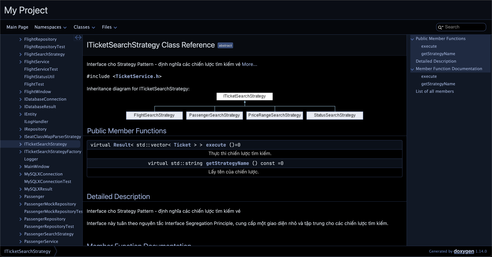

#### 5.2. Class Diagram tổng quát của dự án

```mermaid
classDiagram
    %% UI Layer
    class UI {
        <<interface>>
        +displayMenu() void
        +handleUserInput() void
        +showMessage(string) void
        +showError(string) void
    }

    class MainMenu {
        -_aircraftUI: AircraftUI
        -_flightUI: FlightUI
        -_passengerUI: PassengerUI
        -_ticketUI: TicketUI
        +displayMainMenu() void
        +handleMainMenuChoice(int) void
    }

    class AircraftUI {
        -_aircraftService: AircraftService
        +displayAircraftMenu() void
        +handleAircraftOperations() void
        +displayAircraftList(vector~Aircraft~) void
        +displayAircraftDetails(Aircraft) void
    }

    class FlightUI {
        -_flightService: FlightService
        +displayFlightMenu() void
        +handleFlightOperations() void
        +displayFlightList(vector~Flight~) void
        +displayFlightDetails(Flight) void
    }

    class PassengerUI {
        -_passengerService: PassengerService
        +displayPassengerMenu() void
        +handlePassengerOperations() void
        +displayPassengerList(vector~Passenger~) void
        +displayPassengerDetails(Passenger) void
    }

    class TicketUI {
        -_ticketService: TicketService
        +displayTicketMenu() void
        +handleTicketOperations() void
        +displayTicketList(vector~Ticket~) void
        +displayTicketDetails(Ticket) void
    }

    %% Service Layer
    class IService~T~ {
        <<interface>>
        +getById(int) Result~T~
        +getAll() Result~vector~T~~
        +create(T) Result~T~
        +update(T) Result~T~
        +delete(int) Result~bool~
    }

    class AircraftService {
        -_aircraftRepo: AircraftRepository
        -_logger: Logger
        +getAircraftBySerial(string) Result~Aircraft~
        +validateSeatLayout(SeatClassMap) Result~bool~
        +checkAircraftAvailability(int) Result~bool~
    }

    class FlightService {
        -_flightRepo: FlightRepository
        -_aircraftRepo: AircraftRepository
        -_logger: Logger
        +getFlightsByRoute(string, string) Result~vector~Flight~~
        +getFlightsByDate(datetime) Result~vector~Flight~~
        +updateFlightStatus(int, FlightStatus) Result~bool~
    }

    class PassengerService {
        -_passengerRepo: PassengerRepository
        -_logger: Logger
        +getPassengerByPassport(string) Result~Passenger~
        +validateContactInfo(ContactInfo) Result~bool~
    }

    class TicketService {
        -_ticketRepo: TicketRepository
        -_flightRepo: FlightRepository
        -_passengerRepo: PassengerRepository
        -_logger: Logger
        +bookTicket(int, int, string) Result~Ticket~
        +cancelTicket(int) Result~bool~
        +checkSeatAvailability(int, string) Result~bool~
    }

    %% Repository Layer
    class IRepository~T,IdType~ {
        <<interface>>
        +findById(IdType) Result~T~
        +findAll() Result~vector~T~~
        +create(T) Result~T~
        +update(T) Result~T~
        +deleteById(IdType) Result~bool~
    }

    class AircraftRepository {
        -_db: IDatabaseConnection
        +findBySerial(string) Result~Aircraft~
        +findAvailableAircrafts() Result~vector~Aircraft~~
    }

    class FlightRepository {
        -_db: IDatabaseConnection
        +findByNumber(string) Result~Flight~
        +findByRoute(string, string) Result~vector~Flight~~
        +findByDate(datetime) Result~vector~Flight~~
    }

    class PassengerRepository {
        -_db: IDatabaseConnection
        +findByPassport(string) Result~Passenger~
        +findByEmail(string) Result~Passenger~
    }

    class TicketRepository {
        -_db: IDatabaseConnection
        +findByNumber(string) Result~Ticket~
        +findByFlight(int) Result~vector~Ticket~~
        +findByPassenger(int) Result~vector~Ticket~~
    }

    %% Database Layer
    class IDatabaseConnection {
        <<interface>>
        +connect() Result~bool~
        +disconnect() void
        +executeQuery(string) Result~QueryResult~
        +beginTransaction() Result~bool~
        +commit() Result~bool~
        +rollback() Result~bool~
    }

    class MySQLXConnection {
        -_session: Session
        -_config: ConnectionConfig
        +connect() Result~bool~
        +disconnect() void
        +executeQuery(string) Result~QueryResult~
    }

    %% Core Layer
    class IEntity {
        <<interface>>
        +getId() int
        +getStringId() string
        +toString() string
        +equals(IEntity) bool
    }

    class Aircraft {
        -_id: int
        -_serialNumber: string
        -_model: string
        -_seatClassMap: SeatClassMap
        +getSerialNumber() string
        +getModel() string
        +getSeatClassMap() SeatClassMap
    }

    class Flight {
        -_id: int
        -_flightNumber: string
        -_route: Route
        -_schedule: Schedule
        -_aircraft: Aircraft
        -_status: FlightStatus
        +getFlightNumber() string
        +getRoute() Route
        +getSchedule() Schedule
        +getAircraft() Aircraft
        +getStatus() FlightStatus
    }

    class Passenger {
        -_id: int
        -_passportNumber: string
        -_name: string
        -_contactInfo: ContactInfo
        +getPassportNumber() string
        +getName() string
        +getContactInfo() ContactInfo
    }

    class Ticket {
        -_id: int
        -_ticketNumber: string
        -_flight: Flight
        -_passenger: Passenger
        -_seatNumber: string
        -_price: Price
        -_status: TicketStatus
        +getTicketNumber() string
        +getFlight() Flight
        +getPassenger() Passenger
        +getSeatNumber() string
        +getPrice() Price
        +getStatus() TicketStatus
    }

    %% Value Objects
    class SeatClassMap {
        -_economySeats: int
        -_businessSeats: int
        -_firstSeats: int
        +getEconomySeats() int
        +getBusinessSeats() int
        +getFirstSeats() int
        +validate() bool
    }

    class Route {
        -_departureCode: string
        -_departureName: string
        -_arrivalCode: string
        -_arrivalName: string
        +getDepartureCode() string
        +getArrivalCode() string
        +validate() bool
    }

    class Schedule {
        -_departureTime: datetime
        -_arrivalTime: datetime
        +getDepartureTime() datetime
        +getArrivalTime() datetime
        +validate() bool
    }

    class ContactInfo {
        -_email: string
        -_phone: string
        -_address: string
        +getEmail() string
        +getPhone() string
        +getAddress() string
        +validate() bool
    }

    class Price {
        -_amount: decimal
        -_currency: string
        +getAmount() decimal
        +getCurrency() string
        +validate() bool
    }

    %% Relationships
    %% UI Layer
    UI <|.. MainMenu
    MainMenu --> AircraftUI
    MainMenu --> FlightUI
    MainMenu --> PassengerUI
    MainMenu --> TicketUI

    %% UI to Service
    AircraftUI --> AircraftService
    FlightUI --> FlightService
    PassengerUI --> PassengerService
    TicketUI --> TicketService

    %% Service Layer
    IService~T~ <|.. AircraftService
    IService~T~ <|.. FlightService
    IService~T~ <|.. PassengerService
    IService~T~ <|.. TicketService

    %% Service to Repository
    AircraftService --> AircraftRepository
    FlightService --> FlightRepository
    PassengerService --> PassengerRepository
    TicketService --> TicketRepository

    %% Repository Layer
    IRepository~T,IdType~ <|.. AircraftRepository
    IRepository~T,IdType~ <|.. FlightRepository
    IRepository~T,IdType~ <|.. PassengerRepository
    IRepository~T,IdType~ <|.. TicketRepository

    %% Repository to Database
    AircraftRepository --> IDatabaseConnection
    FlightRepository --> IDatabaseConnection
    PassengerRepository --> IDatabaseConnection
    TicketRepository --> IDatabaseConnection

    %% Database Layer
    IDatabaseConnection <|.. MySQLXConnection

    %% Core Layer
    IEntity <|-- Aircraft
    IEntity <|-- Flight
    IEntity <|-- Passenger
    IEntity <|-- Ticket

    %% Entity to Value Objects
    Aircraft --> SeatClassMap
    Flight --> Route
    Flight --> Schedule
    Flight --> Aircraft
    Passenger --> ContactInfo
    Ticket --> Flight
    Ticket --> Passenger
    Ticket --> Price
```

#### 5.3. Entity Relationship Diagram cho Cơ sở dữn liệu

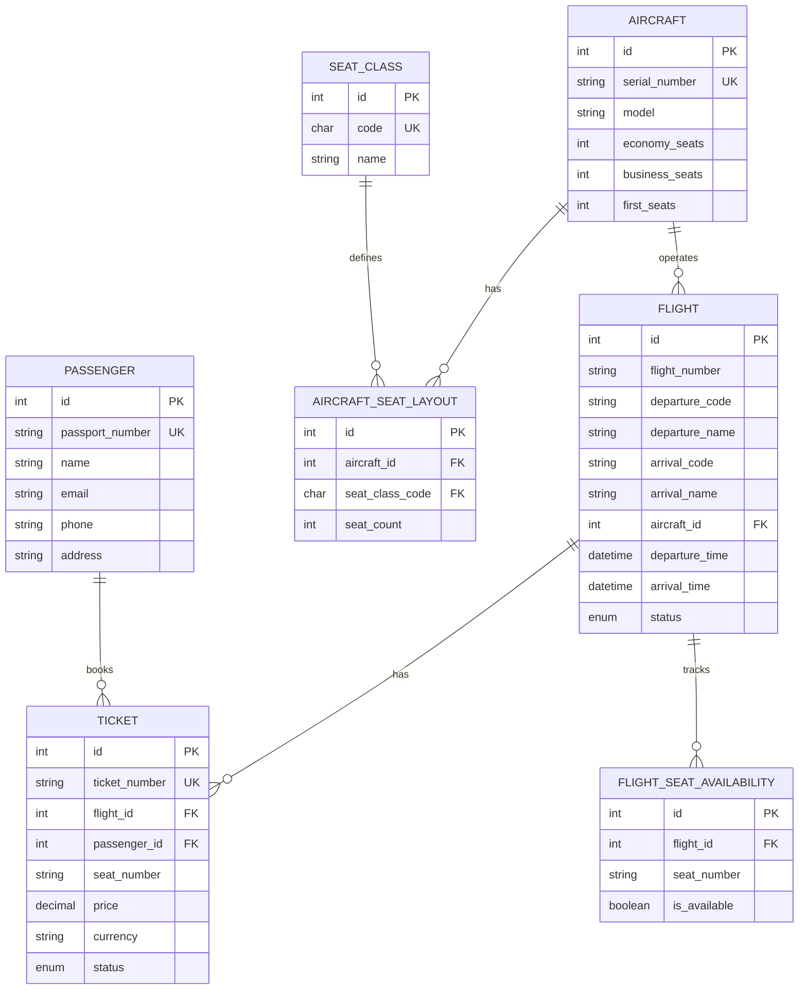

#### 5.4. Các Module Chính

1. **Core Module** (`/src/core/`)
   - Chứa các entity và value objects
   - Định nghĩa các interface cơ bản
   - Xử lý validation và business rules

2. **Database Module** (`/src/database/`)
   - Quản lý kết nối database
   - Xử lý các thao tác CRUD cơ bản
   - Triển khai cho MySQL

3. **Repository Module** (`/src/repositories/`)
   - Interface và implementation cho data access
   - Tách biệt business logic và data access
   - Hỗ trợ caching và optimization

4. **Service Module** (`/src/services/`)
   - Xử lý business logic
   - Quản lý transaction
   - Validation và error handling

5. **Utils Module** (`/src/utils/`)
   - Các helper functions
   - Logger
   - Error handling
   - Common utilities

6. **Tests Module** (`/src/tests/`)
   - Unit tests
   - Integration tests
   - Test utilities và mocks

### 6. Các chủ đề nâng cao (15%)

Dự án đã áp dụng một số chủ đề nâng cao mà không được đề cập trong chương trình học chính thức. Các chủ đề này thể hiện sự tìm hiểu và nghiên cứu độc lập của nhóm:

#### 6.1. Design Patterns Nâng cao

##### 1. Strategy Pattern
- **Mô tả:** Cho phép định nghĩa một họ các thuật toán, đóng gói mỗi thuật toán và làm cho chúng có thể hoán đổi cho nhau
- **Triển khai trong dự án:**
  ```cpp
  class ITicketSearchStrategy {
  public:
      virtual Result<std::vector<Ticket>> execute() = 0;
      virtual std::string getStrategyName() const = 0;
  };

  class PriceRangeSearchStrategy : public ITicketSearchStrategy {
  private:
      std::shared_ptr<TicketRepository> _repository;
      double _minPrice;
      double _maxPrice;
  public:
      Result<std::vector<Ticket>> execute() override;
  };
  ```
- **Lợi ích:**
  * Linh hoạt trong việc thay đổi thuật toán
  * Dễ dàng thêm chiến lược mới
  * Tách biệt logic tìm kiếm

##### 2. Builder Pattern
- **Mô tả:** Cho phép xây dựng các đối tượng phức tạp từng bước một, tách biệt quá trình xây dựng khỏi biểu diễn
- **Triển khai trong dự án:**
  ```cpp
  class TicketSearchBuilder {
  private:
      std::shared_ptr<TicketRepository> _repository;
      std::shared_ptr<Logger> _logger;
      std::optional<FlightNumber> _flightNumber;
      std::optional<Price> _minPrice;
      std::optional<Price> _maxPrice;
      std::optional<TicketStatus> _status;
      std::optional<PassportNumber> _passport;
      std::optional<int> _limit;
      std::optional<std::string> _sortBy;
      bool _sortAscending;

  public:
      TicketSearchBuilder& withFlight(const FlightNumber& flightNumber);
      TicketSearchBuilder& withPriceRange(const Price& minPrice, const Price& maxPrice);
      TicketSearchBuilder& withStatus(TicketStatus status);
      TicketSearchBuilder& withPassenger(const PassportNumber& passport);
      TicketSearchBuilder& withLimit(int limit);
      TicketSearchBuilder& sortBy(const std::string& field, bool ascending = true);
      Result<std::vector<Ticket>> execute();
  };
  ```
- **Lợi ích:**
  * Tạo đối tượng phức tạp từng bước một cách linh hoạt
  * Tách biệt logic xây dựng khỏi biểu diễn
  * Hỗ trợ fluent interface cho code dễ đọc
  * Dễ dàng mở rộng thêm các bước xây dựng mới

##### 3. Registry Pattern
- **Mô tả:** Cung cấp một registry tập trung để quản lý và truy xuất các đối tượng theo một khóa
- **Triển khai trong dự án:**
  ```cpp
  class CurrencyRegistry {
  private:
      inline static std::unordered_map<std::string, std::string> _registry;
      inline static bool _initialized = false;

      static void initialize() {
          if (_initialized) return;
          registerCurrency("VND", "Vietnamese Dong");
          registerCurrency("USD", "United States Dollar");
          // ... other currencies
          _initialized = true;
      }

  public:
      static void registerCurrency(const std::string& code, const std::string& name);
      static std::optional<std::string> getName(const std::string& code);
      static std::vector<std::string> getAllCodes();
      static bool isValidCurrency(const std::string& code);
  };
  ```
- **Lợi ích:**
  * Quản lý tập trung các đối tượng
  * Dễ dàng thêm/xóa đối tượng vào registry
  * Truy xuất nhanh chóng thông qua khóa
  * Tự động khởi tạo với các giá trị mặc định

#### 6.2. Error Handling Nâng cao

##### 1. Result Type Pattern
- **Mô tả:** Pattern xử lý lỗi hiện đại, thay thế cho exceptions
- **Triển khai trong dự án:**
  ```cpp
  template<typename T>
  class Result {
  public:
      static Result<T> success(const T& value);
      static Result<T> error(const Error& error);
      bool isSuccess() const;
      T getValue() const;
      Error getError() const;
  };
  ```
- **Lợi ích:**
  * Xử lý lỗi rõ ràng và có cấu trúc
  * Không sử dụng exceptions
  * Dễ dàng theo dõi luồng lỗi

#### 6.3. Database Programming Nâng cao

##### 1. Prepared Statements và Parameter Binding
- **Mô tả:** Sử dụng prepared statements để tối ưu hiệu suất và bảo mật
- **Triển khai trong dự án:**
  ```cpp
  class IDatabaseConnection {
  public:
      virtual Result<int> prepareStatement(const std::string& query) = 0;
      virtual VoidResult setString(const int& statementId, const int& paramIndex, const std::string& value) = 0;
      virtual VoidResult setInt(const int& statementId, const int& paramIndex, const int& value) = 0;
      virtual VoidResult setDouble(const int& statementId, const int& paramIndex, const double& value) = 0;
      virtual VoidResult setDateTime(const int& statementId, const int& paramIndex, const std::tm& value) = 0;
      virtual Result<bool> executeStatement(const int& statementId) = 0;
  };
  ```
- **Lợi ích:**
  * Tăng hiệu suất bằng cách tái sử dụng câu lệnh đã biên dịch
  * Ngăn chặn SQL injection
  * Tự động escape các giá trị đặc biệt
  * Hỗ trợ nhiều kiểu dữ liệu khác nhau

##### 2. Result Set Abstraction
- **Mô tả:** Tạo một interface trừu tượng cho việc xử lý kết quả truy vấn
- **Triển khai trong dự án:**
  ```cpp
  class IDatabaseResult {
  public:
      virtual Result<bool> next() = 0;
      virtual Result<std::string> getString(const int& columnIndex) = 0;
      virtual Result<int> getInt(const int& columnIndex) = 0;
      virtual Result<double> getDouble(const int& columnIndex) = 0;
      virtual Result<std::tm> getDateTime(const int& columnIndex) = 0;
      // Overloads cho tên cột
      virtual Result<std::string> getString(const std::string& columnName) = 0;
      virtual Result<int> getInt(const std::string& columnName) = 0;
      virtual Result<double> getDouble(const std::string& columnName) = 0;
      virtual Result<std::tm> getDateTime(const std::string& columnName) = 0;
  };
  ```
- **Lợi ích:**
  * Tách biệt logic xử lý kết quả khỏi database driver
  * Hỗ trợ truy xuất theo chỉ số và tên cột
  * Xử lý lỗi có cấu trúc với Result type
  * Dễ dàng mở rộng cho các kiểu dữ liệu mới

##### 3. Error Handling và Logging
- **Mô tả:** Xử lý lỗi database một cách có cấu trúc và ghi log
- **Triển khai trong dự án:**
  ```cpp
  class MySQLXConnection : public IDatabaseConnection {
  private:
      std::shared_ptr<Logger> _logger;
      void logError(const std::string& operation, const std::string& error);
      
  public:
      Result<bool> connect(const std::string& host, const std::string& user,
                          const std::string& password, const std::string& database,
                          const int& port = 33060) override;
  };
  ```
- **Lợi ích:**
  * Theo dõi được các lỗi database
  * Dễ dàng debug và xử lý sự cố
  * Tích hợp với hệ thống logging chung
  * Bảo mật thông tin nhạy cảm

##### 4. Connection Pooling
- **Mô tả:** Quản lý pool các kết nối database để tối ưu hiệu suất
- **Triển khai trong dự án:**
  ```cpp
  class ConnectionPool {
  private:
      std::vector<std::shared_ptr<IDatabaseConnection>> _connections;
      std::mutex _mutex;
      size_t _maxSize;
      size_t _currentSize;
      
  public:
      std::shared_ptr<IDatabaseConnection> acquire();
      void release(std::shared_ptr<IDatabaseConnection> conn);
  };
  ```
- **Lợi ích:**
  * Tối ưu hiệu suất bằng cách tái sử dụng kết nối
  * Giảm tải cho database server
  * Quản lý tài nguyên hiệu quả
  * Thread-safe trong môi trường đa luồng

##### 5. Transaction Management
- **Mô tả:** Quản lý transaction để đảm bảo tính toàn vẹn dữ liệu
- **Triển khai trong dự án:**
  ```cpp
  class Transaction {
  private:
      std::shared_ptr<IDatabaseConnection> _conn;
      bool _isActive;
      
  public:
      Result<bool> begin();
      Result<bool> commit();
      Result<bool> rollback();
      bool isActive() const;
  };
  ```
- **Lợi ích:**
  * Đảm bảo tính toàn vẹn dữ liệu
  * Hỗ trợ rollback khi có lỗi
  * Quản lý transaction một cách rõ ràng
  * Tích hợp với error handling

#### 6.4. Containerization với Docker

##### 1. Docker Compose cho Development Environment
- **Mô tả:** Sử dụng Docker Compose để tạo và quản lý môi trường phát triển với MySQL server
- **Triển khai trong dự án:**
  ```yaml
  services:
    mysql:
      image: mysql:8.0
      container_name: airlines_mysql
      command: --default-authentication-plugin=mysql_native_password --mysqlx=ON
      environment:
        MYSQL_ROOT_PASSWORD: ${MYSQL_ROOT_PASSWORD:-phucHoang133205}
        MYSQL_DATABASE: ${MYSQL_DATABASE:-airlines_db}
        MYSQL_USER: ${MYSQL_USER:-nphoang}
        MYSQL_PASSWORD: ${MYSQL_PASSWORD:-phucHoang133205}
        TZ: Asia/Ho_Chi_Minh
      ports:
        - "3306:3306"   # Classic MySQL protocol
        - "33060:33060" # X Protocol port
      volumes:
        - mysql_data:/var/lib/mysql
        - ./schema.sql:/docker-entrypoint-initdb.d/schema.sql
      healthcheck:
        test: ["CMD", "mysqladmin", "ping", "-h", "localhost"]
        interval: 5s
        timeout: 10s
        retries: 10
        start_period: 10s

  volumes:
    mysql_data:
  ```
- **Lợi ích:**
  * Môi trường phát triển nhất quán
  * Dễ dàng setup và chạy
  * Tự động khởi tạo database schema
  * Dữ liệu được lưu trữ bền vững
  * Hỗ trợ health check cho database
  * Cấu hình thời gian theo múi giờ Việt Nam

##### 2. Environment Configuration
- **Mô tả:** Quản lý cấu hình môi trường cho database thông qua biến môi trường
- **Triển khai trong dự án:**
  ```yaml
  environment:
    MYSQL_ROOT_PASSWORD: ${MYSQL_ROOT_PASSWORD:-phucHoang133205}
    MYSQL_DATABASE: ${MYSQL_DATABASE:-airlines_db}
    MYSQL_USER: ${MYSQL_USER:-nphoang}
    MYSQL_PASSWORD: ${MYSQL_PASSWORD:-phucHoang133205}
  ```
- **Lợi ích:**
  * Tách biệt cấu hình và code
  * Dễ dàng thay đổi môi trường
  * Bảo mật thông tin nhạy cảm
  * Có giá trị mặc định cho development

## III. Hướng dẫn chạy chương trình

### 1. Cài đặt thủ công

#### 1.1. Yêu cầu hệ thống
- Hệ điều hành: macOS, Linux hoặc Windows
- C++ Compiler: GCC 9.0+ hoặc Clang 10.0+
- CMake 3.15+
- MySQL Server 8.0+
- MySQL Connector/C++ 8.0+
- Google Test Framework (cho testing)

#### 1.2. Cài đặt các thư viện cần thiết

##### macOS
```bash
# Cài đặt Homebrew nếu chưa có
/bin/bash -c "$(curl -fsSL https://raw.githubusercontent.com/Homebrew/install/HEAD/install.sh)"

# Cài đặt các công cụ cần thiết
brew install cmake
brew install mysql
brew install mysql-connector-cpp
brew install googletest
```

##### Ubuntu/Debian
```bash
# Cập nhật package list
sudo apt update

# Cài đặt các công cụ cần thiết
sudo apt install build-essential
sudo apt install cmake
sudo apt install libmysqlclient-dev
sudo apt install libmysqlcppconn-dev
sudo apt install libgtest-dev
```

##### Windows
1. Cài đặt Visual Studio 2019 hoặc mới hơn
2. Cài đặt CMake từ https://cmake.org/download/
3. Cài đặt MySQL Server từ https://dev.mysql.com/downloads/mysql/
4. Cài đặt MySQL Connector/C++ từ https://dev.mysql.com/downloads/connector/cpp/

#### 1.3. Cấu hình và Build

1. Clone repository:
```bash
git clone https://github.com/your-username/airline-reservation-system.git
cd airline-reservation-system
```

2. Tạo thư mục build:
```bash
mkdir build
cd build
```

3. Cấu hình với CMake:
```bash
cmake ..
```

4. Build project:
```bash
cmake --build .
```

#### 1.4. Cấu hình Database

1. Tạo database và user:
```sql
CREATE DATABASE airline_system;
CREATE USER 'airline_user'@'localhost' IDENTIFIED BY 'airline_pass';
GRANT ALL PRIVILEGES ON airline_system.* TO 'airline_user'@'localhost';
FLUSH PRIVILEGES;
```

2. Import schema:
```bash
mysql -u airline_user -p airline_system < source/schema.sql
```

#### 1.5. Chạy chương trình

1. Chạy ứng dụng:
```bash
./airline_system
```

2. Chạy tests:
```bash
./airline_system_tests
```

### 2. Sử dụng Docker

#### 2.1. Yêu cầu hệ thống
- Docker Engine 20.10+
- Docker Compose 2.0+
- Git

#### 2.2. Cài đặt Docker

##### macOS
```bash
# Cài đặt Docker Desktop
brew install --cask docker
```

##### Ubuntu/Debian
```bash
# Cài đặt Docker Engine
sudo apt update
sudo apt install docker.io docker-compose
sudo systemctl start docker
sudo systemctl enable docker
```

##### Windows
1. Tải và cài đặt Docker Desktop từ https://www.docker.com/products/docker-desktop

#### 2.3. Build và Chạy với Docker

1. Clone repository:
```bash
git clone https://github.com/your-username/airline-reservation-system.git
cd airline-reservation-system
```

2. Build Docker image:
```bash
docker build -t airline-system .
```

3. Chạy ứng dụng với Docker Compose:
```bash
# Khởi động database và ứng dụng
docker-compose up -d

# Xem logs
docker-compose logs -f

# Dừng các container
docker-compose down
```

#### 2.4. Cấu trúc Docker

1. **Dockerfile cho ứng dụng:**
```dockerfile
FROM gcc:9.4

# Cài đặt các dependencies
RUN apt-get update && apt-get install -y \
    cmake \
    libmysqlclient-dev \
    libmysqlcppconn-dev \
    libgtest-dev \
    && rm -rf /var/lib/apt/lists/*

# Copy source code
WORKDIR /app
COPY . .

# Build ứng dụng
RUN mkdir build && cd build \
    && cmake .. \
    && cmake --build .

# Chạy ứng dụng
CMD ["./build/airline_system"]
```

2. **Docker Compose:**
```yaml
version: '3.8'
services:
  app:
    build: .
    depends_on:
      - mysql
    environment:
      - DB_HOST=mysql
      - DB_PORT=3306
      - DB_NAME=airline_system
      - DB_USER=airline_user
      - DB_PASSWORD=airline_pass
    networks:
      - airline-network

  mysql:
    image: mysql:8.0
    container_name: airline_db
    environment:
      MYSQL_ROOT_PASSWORD: root
      MYSQL_DATABASE: airline_system
      MYSQL_USER: airline_user
      MYSQL_PASSWORD: airline_pass
    ports:
      - "3306:3306"
    volumes:
      - ./source/schema.sql:/docker-entrypoint-initdb.d/schema.sql
      - mysql_data:/var/lib/mysql
    command: --default-authentication-plugin=mysql_native_password
    networks:
      - airline-network

networks:
  airline-network:
    driver: bridge

volumes:
  mysql_data:
```

#### 2.5. Các lệnh Docker hữu ích

```bash
# Xem danh sách container đang chạy
docker ps

# Xem logs của container
docker logs airline_db

# Truy cập vào container MySQL
docker exec -it airline_db mysql -u airline_user -p

# Backup database
docker exec airline_db mysqldump -u root -proot airline_system > backup.sql

# Restore database
docker exec -i airline_db mysql -u root -proot airline_system < backup.sql

# Xóa tất cả container và volumes
docker-compose down -v
```
## IV. Link video demo